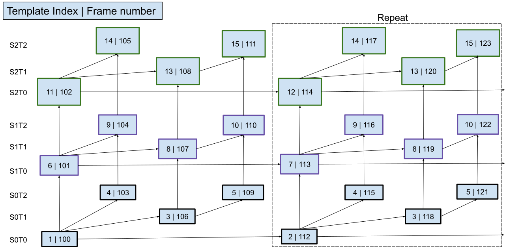

RTP Payload Format For AV1 (v0.5)
===================================
{:.no_toc }

**Status:** The Alliance for Open Media AV1 Real-Time Communications Subgroup Working Draft (WD)

## Abstract
{:.no_toc }

This document describes an RTP payload format for the [AV1 video codec][AV1]. The payload format has wide applicability, from low bit-rate peer-to-peer usage, to high bit-rate multi-party video conferences. It includes provisions for temporal and spatial scalability.

## Status of this Document
{:.no_toc }

This document is a working draft of the Real-Time Communications Subgroup.

## Contents
{:.no_toc }

* TOC
{:toc}

## 1 Introduction

This document describes an RTP payload specification applicable to the transmission of video streams encoded using the [AV1 video codec][AV1]. In AV1, the smallest individual video encoder entity presented for transport is the Open Bitstream Unit (OBU). This specification allows both for fragmentation and aggregation of OBUs in the same RTP packet, but explicitly disallows doing so across frame boundaries.

Appendix A of this document describes the Dependency Descriptor (DD) RTP Header extension, which conveys information about individual video frames and the dependencies between them. This allows forwarding of video frames in situations where an intermediary does not wish to examine the RTP payload or does not have access to it, such as when the RTP payload is encrypted end-to-end. While the DD RTP Header extension was designed for use with AV1, it may prove useful for other codecs as well.

This specification also provides several mechanisms through which scalability structures are described. AV1 uses the concept of predefined scalability structures. These are a set of commonly used picture prediction structures that can be referenced simply via an indicator value (scalability_mode_idc, residing in the sequence header). For cases that do not fall in any of the predefined cases, there is a mechanism for describing the scalability structure. These bitstream parameters greatly simplify the organization of the corresponding data at the RTP payload format level.

## 2 Conventions, Definitions and Acronyms

The key words "MUST", "MUST NOT", "REQUIRED", "SHALL", "SHALL NOT", "SHOULD", "SHOULD NOT", "RECOMMENDED", "MAY", and "OPTIONAL" in this document are to be interpreted as described in [RFC2119].

Coded frame
: The representation of one frame before the decoding process.

Frame
: A frame in this document is synonymous to a Coded frame.

**Note:** In contrast, in AV1, Frame is defined as the representation of video signals in the spatial domain.
{:.alert .alert-info }

**Note:** Multiple frames may be present at the same instant in time.
{:.alert .alert-info }

Media-Aware Network Element (MANE)
: A middlebox that relays streams among transmitting and receiving clients by selectively forwarding packets and which may have access to the media ([RFC6184]).

OBU element
: An OBU, or a fragment of an OBU, contained in an RTP packet.

Open Bitstream Unit (OBU)
: The smallest bitstream data framing unit in AV1. All AV1 bitstream structures are packetized in OBUs.

"S" Mode
: A scalability mode in which multiple encodings are sent on the same SSRC. This includes the S2T1, S2T1h, S2T2, S2T2h, S2T3, S2T3h, S3T1, S3T1h, S3T2, S3T2h, S3T3 and S3T3h scalability modes defined in Section 6.7.5 of [AV1]. 

Selective Forwarding Middlebox (SFM)
: A middlebox that relays streams among transmitting and receiving clients by selectively forwarding packets without requiring access to the media ([RFC7667]).

Temporal unit
: Defined by the AV1 specification: A temporal unit consists of all the OBUs that are associated with a specific, distinct time instant.

## 3 Media Format Description

The AV1 codec can maintain up to eight reference frames, of which up to seven can be referenced by any new frame. AV1 also allows a frame to use another frame of a different spatial resolution as a reference frame. This allows internal resolution changes without requiring the use of key frames. These features together enable an AV1 encoder to implement various forms of coarse-grained scalability, including temporal, spatial, and quality scalability modes, as well as combinations of these, without the need for explicit scalable coding tools.

Spatial and quality layers define different and possibly dependent representations of a single input frame. For a given spatial layer, temporal layers define different frame rates of video. Spatial layers allow a frame to be encoded at different spatial resolutions, whereas quality layers allow a frame to be encoded at the same spatial resolution but at different qualities (and thus with different amounts of coding error). AV1 supports quality layers as spatial layers without any resolution changes; hereinafter, the term "spatial layer" is used to represent both spatial and quality layers.

This payload format specification provides for specific mechanisms through which such temporal and spatial scalability layers can be described and communicated.

Temporal and spatial scalability layers are associated with non-negative integer IDs. The lowest layer of either type has an ID equal to 0.

**Note:** Layer dependencies are constrained by the AV1 specification such that a temporal layer with temporal_id T and spatial layer with spatial_id S are only allowed to reference previously coded video data having temporal_id T' and spatial_id S', where T' <= T and S' <= S. 
{:.alert .alert-info }

## 4 Payload Format

This section describes how the encoded AV1 bitstream is encapsulated in RTP.

### 4.1 RTP Header Usage

The general RTP payload format follows the RTP header format [RFC3550] and generic RTP header extensions [RFC8285], and is shown below.

The Dependency Descriptor and AV1 aggregation header are described in this document. The payload itself is a series of OBU elements, preceded by length information as detailed later in this document. An OBU element is either an entire OBU or an OBU fragment.

<pre><code>
 0                   1                   2                   3
 0 1 2 3 4 5 6 7 8 9 0 1 2 3 4 5 6 7 8 9 0 1 2 3 4 5 6 7 8 9 0 1
+-+-+-+-+-+-+-+-+-+-+-+-+-+-+-+-+-+-+-+-+-+-+-+-+-+-+-+-+-+-+-+-+
|V=2|P|X|  CC   |M|     PT      |       sequence number         |
+-+-+-+-+-+-+-+-+-+-+-+-+-+-+-+-+-+-+-+-+-+-+-+-+-+-+-+-+-+-+-+-+
|                           timestamp                           |
+-+-+-+-+-+-+-+-+-+-+-+-+-+-+-+-+-+-+-+-+-+-+-+-+-+-+-+-+-+-+-+-+
|           synchronization source (SSRC) identifier            |
+=+=+=+=+=+=+=+=+=+=+=+=+=+=+=+=+=+=+=+=+=+=+=+=+=+=+=+=+=+=+=+=+
|            contributing source (CSRC) identifiers             |
|                             ....                              |
+=+=+=+=+=+=+=+=+=+=+=+=+=+=+=+=+=+=+=+=+=+=+=+=+=+=+=+=+=+=+=+=+
|         0x100         |  0x0  |       extensions length       |
+=+=+=+=+=+=+=+=+=+=+=+=+=+=+=+=+=+=+=+=+=+=+=+=+=+=+=+=+=+=+=+=+
|   0x1(ID)     |  hdr_length   |                               |
+=+=+=+=+=+=+=+=+=+=+=+=+=+=+=+=+                               |
|                                                               |
|          dependency descriptor (hdr_length #bytes)            |
|                                                               |
|                               +-+-+-+-+-+-+-+-+-+-+-+-+-+-+-+-+
|                               | Other rtp header extensions...|
+=+=+=+=+=+=+=+=+=+=+=+=+=+=+=+=+=+=+=+=+=+=+=+=+=+=+=+=+=+=+=+=+
| AV1 aggr hdr  |                                               |
+-+-+-+-+-+-+-+-+                                               |
|                                                               |
|                   Bytes 2..N of AV1 payload                   |
|                                                               |
|                               +-+-+-+-+-+-+-+-+-+-+-+-+-+-+-+-+
|                               :    OPTIONAL RTP padding       |
+-+-+-+-+-+-+-+-+-+-+-+-+-+-+-+-+-+-+-+-+-+-+-+-+-+-+-+-+-+-+-+-+
</code></pre>

### 4.2 RTP Header Marker Bit (M)

The RTP header Marker bit MUST be set equal to 0 if the packet is not the last packet of the temporal unit, it SHOULD be set equal to 1 otherwise.

**Note:** It is possible for a receiver to receive the last packet of a temporal unit without the marker bit being set equal to 1, and a receiver should be able to handle this case. The last packet of a temporal unit is also indicated by the next packet, in RTP sequence number order, having an incremented timestamp.
{:.alert .alert-info }

### 4.3 Dependency Descriptor RTP Header Extension

To facilitate the work of selectively forwarding portions of a scalable video bitstream, as is done by a Selective Forwarding Middlebox (SFM), certain information needs to be provided for each packet. Appendix A of this specification defines how this information is communicated.

### 4.4 AV1 Aggregation Header

The aggregation header is carried in the first byte of the RTP payload and is used to indicate if the first and/or last OBU element in the payload is a fragment of an OBU. The aggregation header is not part of the AV1 bitstream and MUST NOT be presented to an AV1 decoder.

The structure is as follows.

<pre><code>
 0 1 2 3 4 5 6 7
+-+-+-+-+-+-+-+-+
|Z|Y| W |N|-|-|-|
+-+-+-+-+-+-+-+-+
</code></pre>

Z: MUST be set to 1 if the first OBU element is an OBU fragment that is a continuation of an OBU fragment from the previous packet, and MUST be set to 0 otherwise.

Y: MUST be set to 1 if the last OBU element is an OBU fragment that will continue in the next packet, and MUST be set to 0 otherwise.

W: two bit field that describes the number of OBU elements in the packet. This field MUST be set equal to 0 or equal to the number of OBU elements contained in the packet. If set to 0, each OBU element MUST be preceded by a length field. If not set to 0 (i.e., W = 1, 2 or 3) the last OBU element MUST NOT be preceded by a length field. Instead, the length of the last OBU element contained in the packet can be calculated as follows:

<pre><code>
Length of the last OBU element = 
   length of the RTP payload
 - length of aggregation header
 - length of previous OBU elements including length fields
</code></pre>

N: MUST be set to 1 if the packet is the first packet of a coded video sequence, and MUST be set to 0 otherwise.

**Note:** if N equals 1 then Z must equal 0.
{:.alert .alert-info }

### 4.5 Payload Structure

The smallest high-level syntax unit in AV1 is the OBU. All AV1 bitstream structures are packetized in OBUs. Each OBU has a header, which provides identifying information for the contained data (payload).

The payload contains a series of one or more OBU elements. The design allows for a combination of aggregation and fragmentation of OBUs, i.e., a set of OBU elements in which the first and/or last element is a fragment of an OBU.

The length field is encoded using leb128. Leb128 is defined in the AV1 specification, and provides for a variable-sized, byte-oriented encoding of non-negative integers where the first bit of each (little-endian) byte indicates whether or not additional bytes are used in the representation (AV1, Section 4.10.5).

Whether or not the first and/or last OBU element is a fragment of an OBU is signaled in the aggregation header. Fragmentation may occur regardless of how the W field is set.

The AV1 specification allows OBUs to have an optional size field called obu_size (also leb128 encoded), signaled by the obu_has_size_field flag in the OBU header. To minimize overhead, the obu_has_size_field flag SHOULD be set to zero in all OBUs.

The following figure shows an example payload where the length field is shown as taking two bytes for the first and second OBU elements and one byte for the last (N) OBU element.

<pre><code>
0                   1                   2                   3
0 1 2 3 4 5 6 7 8 9 0 1 2 3 4 5 6 7 8 9 0 1 2 3 4 5 6 7 8 9 0 1
+-+-+-+-+-+-+-+-+-+-+-+-+-+-+-+-+-+-+-+-+-+-+-+-+-+-+-+-+-+-+-+-+
|Z|Y|0 0|N|-|-|-|  OBU element 1 size (leb128)  |               |
+-+-+-+-+-+-+-+-+-+-+-+-+-+-+-+-+-+-+-+-+-+-+-+-+               |
:                                                               :
:                      OBU element 1 data                       :
:                                                               :
|                                                               |
|                               +-+-+-+-+-+-+-+-+-+-+-+-+-+-+-+-+
|                               |  OBU element 2 size (leb128)  |
+-+-+-+-+-+-+-+-+-+-+-+-+-+-+-+-+-+-+-+-+-+-+-+-+-+-+-+-+-+-+-+-+
:                                                               :
:                       OBU element 2 data                      :
:                                                               :
|                                                               |
+-+-+-+-+-+-+-+-+-+-+-+-+-+-+-+-+-+-+-+-+-+-+-+-+-+-+-+-+-+-+-+-+
:                                                               :
:                              ...                              :
:                                                               :
+-+-+-+-+-+-+-+-+-+-+-+-+-+-+-+-+-+-+-+-+-+-+-+-+-+-+-+-+-+-+-+-+
|OBU e... N size|                                               |
+-+-+-+-+-+-+-+-+       OBU element N data      +-+-+-+-+-+-+-+-+
|                                               |
+-+-+-+-+-+-+-+-+-+-+-+-+-+-+-+-+-+-+-+-+-+-+-+-+
</code></pre>

The following figure shows an example payload containing two OBU elements where the last OBU element omits the length field (and the W field is set to 2). The size of the last OBU element can be calculated given the formula described in Section 4.4.

<pre><code>
OBU element example size calculation:
Total RTP payload size    = 303 bytes
AV1 aggregation header    = 1 byte
OBU element 1 size        = 2 bytes
OBU element 1 data        = 200 bytes
OBU element 2 data        = 303 - 1 - (2 + 200) = 100 bytes

0                   1                   2                   3
0 1 2 3 4 5 6 7 8 9 0 1 2 3 4 5 6 7 8 9 0 1 2 3 4 5 6 7 8 9 0 1
+-+-+-+-+-+-+-+-+-+-+-+-+-+-+-+-+-+-+-+-+-+-+-+-+-+-+-+-+-+-+-+-+
|Z|Y|1 0|N|-|-|-|  OBU element 1 size (leb128)  |               |
+-+-+-+-+-+-+-+-+-+-+-+-+-+-+-+-+-+-+-+-+-+-+-+-+               |
|                                                               |
:                                                               :
:                      OBU element 1 data                       :
:                                                               :
|                                                               |
|                               +-+-+-+-+-+-+-+-+-+-+-+-+-+-+-+-+
|                               |                               |
+-+-+-+-+-+-+-+-+-+-+-+-+-+-+-+-+                               |
|                                                               |
:                                                               :
:                      OBU element 2 data                       :
:                                                               :
|                                                               |
+-+-+-+-+-+-+-+-+-+-+-+-+-+-+-+-+-+-+-+-+-+-+-+-+-+-+-+-+-+-+-+-+
</code></pre>

## 5 Packetization Rules

Each RTP packet MUST NOT contain OBUs that belong to different temporal units.

The temporal delimiter OBU, if present, SHOULD be removed when transmitting, and MUST be ignored by receivers. Tile list OBUs are not supported. They SHOULD be removed when transmitted, and MUST be ignored by receivers.

If a sequence header OBU is present in an RTP packet and operating_points_cnt_minus_1 > 0 then for any number i where 0 <= i < operating_points_cnt_minus_1 the following MUST be true: (operating_point_idc[i] & operating_point_idc[i+1]) == operating_point_idc[i+1].

A sender MAY produce a sequence header with operating_points_cnt_minus_1 = 0 and operating_point_idc[0] = 0xFFF and seq_level_idx[0] = 0. In such case, seq_level_idx[0] does not reflect the level of the operating point.

**Note:** The intent is to disable OBU dropping in the AV1 decoder. To ensure a decoder’s capabilities are not exceeded, OBU filtering should instead be implemented at the system level (e.g., in a MANE).
{:.alert .alert-info }

If more than one OBU contained in an RTP packet has an OBU extension header, then the values of the temporal_id and spatial_id MUST be the same in all such OBUs in the RTP packet.

If a sequence header OBU is present in an RTP packet, then it	SHOULD be the first OBU in the packet. OBUs that are not associated with a particular layer (and thus do not have an OBU extension header) SHOULD be in the beginning of a packet, following the sequence header OBU if present.

A sequence header OBU SHOULD be included in the base layer when scalable encoding is used. When simulcast encodings are transported on the same SSRC (an "S" mode), a sequence header OBU SHOULD be aggregated with each spatial layer. This ensures that if an intermediary removes simulcast encodings from the bitstream before forwarding, the modified bitstream will still be decodable.

### 5.1 Examples

The following are example packetizations of OBU sequences. A two-letter notation is used to identify the OBU type: FH - frame header, TG - tile group, FR - frame, SH - sequence header, TD - temporal delimitered, MD - metadata. Parentheses after the type indicate the temporal_id and spatial_id combination. For example "TG(0,1)" indicates a tile group OBU with temporal_id equal to 0 and spatial_id equal to 1.

The following is an example coded video sequence:
<pre><code>
    TD SH MD MD(0,0) FH(0,0) TG0(0,0) MD(0,1) FH(0,1) TG(0,1)
</code></pre>

This sequence could be packetized as follows. First, the TD OBU is dropped. Then, the following packetization grouping (indicated using square brackets) may be used:
<pre><code>
    [ SH MD MD(0,0) FH(0,0) TG(0,0) ] [ MD(0,1) FH(0,1) TG(0,1) ]
</code></pre>

It is also possible to send each OBU in its own RTP packet:
<pre><code>
    [ SH ] [ MD ] [ MD(0,0) ] [ FH(0,0) ] [ TG(0,0) ] ...
</code></pre>

The following packetization grouping would not be allowed, since it combines data from different spatial layers in the same packet:
<pre><code>
    [ SH MD MD(0,0) FH(0,0) TG(0,0) MD(0,1) FH(0,1) TG(0,1) ]
</code></pre>

## 6 MANE and SFM Behavior

If a packet contains an OBU with an OBU extension header then the entire packet is considered associated with the layer identified by the temporal_id and spatial_id combination that are indicated in the extension header. If a packet does not contain any OBU with an OBU extension header, then it is considered to be associated with all operating points.

The general function of a MANE or SFM is to selectively forward packets to receivers. To make forwarding decisions a MANE may inspect the media payload, so that it may need to be able to parse the AV1 bitstream and if so, cannot function when end-to-end encryption is enabled. An SFM does not parse the AV1 bitstream and therefore needs to obtain the information relevant to selective forwarding by other means, such as the Dependency Descriptor described in Appendix A. In addition to enabling bitstream-independent forwarding and support for end-to-end encryption, the Dependency Descriptor also enables forwarding where the metadata OBU provided in the AV1 bitstream is not sufficient to express the structure of the stream.

### 6.1 Simulcast

The RTP payload defined in this specification supports two distinct modes for transport of simulcast encodings. In either mode, simulcast transport MUST only be used to convey multiple encodings from the same source. Also, in either mode, a sequence header OBU SHOULD be aggregated with each spatial layer. Both modes MUST be supported by implementations of this specification.

When simulcast encodings are transported each on a separate RTP stream, each simulcast encoding utilizes a distinct bitstream containing its own distinct Sequence Header and Scalability Metadata OBUs. This mode utilizes distinct SSRCs and Restriction Identifiers (RIDs) for each encoding as described in [I-D.ietf-avtext-rid] and, as a result, RTCP feedback can be provided for each simulcast encoding. This mode of simulcast transport, which MUST be supported by SFMs, utilizes Session Description Protocol (SDP) signaling as described in [I-D.ietf-mmusic-sdp-simulcast] and [I-D.ietf-mmusic-rid].

When simulcast encodings are transported on a single RTP stream, RIDs are not used and the Sequence Header and Scalability Metadata OBUs (utilizing an 'S' mode) convey information relating to all encodings. This simulcast transport mode is possible since AV1 enables multiple simulcast encodings to be provided within a single bitstream. However, in this mode, RTCP feedback cannot be provided for each simulcast encoding, but only for the aggregate, since only a single SSRC is used. This mode of simulcast transport MAY be supported by SFMs.

### 6.1.1 Example

In this example, it is desired to send three simulcast encodings, each containing three temporal layers. When sending all encodings on a single SSRC, scalability mode 'S3T3' would be indicated within the scalability metadata OBU, and the Dependency Descriptor describes the dependency structure of all encodings.

When sending each simulcast encoding on a distinct SSRC, the scalability mode 'L1T3' would be indicated within the scalability metadata OBU of each bitstream, and the Dependency Descriptor in each stream describes only the dependency structure for that individual encoding. A distinct spatial_id (e.g. 0, 1, 2) could be used for each stream (if a single AV1 encoder is used to produce the three simulcast encodings), but if distinct AV1 encoders are used, the spatial_id values may not be distinct.

## 7 Payload Format Parameters

This section specifies the parameters that MAY be used to select optional features of the payload format and certain features of the bitstream.

### 7.1 Media Type Definition

* Type name:
  * **video**
* Subtype name:
  * **AV1**
* Required parameters:
  * None.
* Optional parameters:
  * These parameters are used to signal the capabilities of a receiver implementation. If the implementation is willing to receive media, **profile** and **level-idx** parameters MUST be provided. These parameters MUST NOT be used for any other purpose.
    * **profile**: The value of **profile** is an integer indicating the highest AV1 profile supported by the receiver. The range of possible values is identical to the **seq_profile** syntax element specified in [AV1]
    * **level-idx**: The value of **level-idx** is an integer indicating the highest AV1 level supported by the receiver. The range of possible values is identical to the **seq_level_idx** syntax element specified in [AV1]
    * **tier**: The value of **tier** is an integer indicating tier of the indicated level. The range of possible values is identical to the **seq_tier** syntax element specified in [AV1]. If parameter is not present, level's tier is to be assumed equal to 0

* Encoding considerations:
  * This media type is framed in RTP and contains binary data; see Section 4.8 of [RFC6838].
* Security considerations:
  * See Section 10.
* Interoperability considerations:
  * None.
* Published specification:
  * [AV1 video codec][AV1]
* Applications which use this media type:
  * Video over IP, video conferencing.
* Fragment identifier considerations:
  * N/A.
* Additional information:
  * None.
* Person & email address to contact for further information:
  * TODO
* Intended usage:
  * COMMON
* Restrictions on usage:
  * This media type depends on RTP framing, and hence is only defined for transfer via RTP [RFC3550].
* Author:
  * TODO
* Change controller:
  * AoMedia Codec Group, RTC sub-group

### 7.2 SDP Parameters
The receiver MUST ignore any fmtp parameter not specified in this document.

#### 7.2.1 Mapping of Media Subtype Parameters to SDP
The media type video/AV1 string is mapped to fields in the Session Description Protocol (SDP) per [RFC4566] as follows:
* The media name in the "m=" line of SDP MUST be video.
* The encoding name in the "a=rtpmap" line of SDP MUST be AV1 (the media subtype).
* The clock rate in the "a=rtpmap" line MUST be 90000.
* The parameters "**profile**", and "**level-idx**", MUST be included in the "a=fmtp" line of SDP if SDP is used to declare receiver capabilities. These parameters are expressed as a media subtype string, in the form of a semicolon separated list of parameter=value pairs.
* Parameter "**tier**" MAY be included alongside "**profile**" and "**level-idx** parameters in "a=fmtp" line if the indicated level supports a non-zero tier.

### 7.2.2 RID Restrictions Mapping for AV1

The RID specification declares the set of codec-agnostic restrictions for media streams. All the restrictions are optional and are subject to negotiation based on the SDP Offer/Answer rules described in Section 6 in [I-D.ietf-mmusic-rid]. When these restrictions are applied to the AV1 codec, they MUST have the following interpretation:
* **max-width**, maximum width of the frame in units of samples. The meaning of the restriction is the same as variable **MaxHSize** of the levels table from Section A.3 of [AV1].
* **max-height**, maximum height of the frame in units of samples. The meaning of the restriction is the same as variable **MaxVSize** of the levels table from Section A.3 of [AV1].
* **max-fps**, maximum number of temporal units per second.
* **max-fs**, maximum size of the frame in units of samples. The meaning of the restriction is the same as variable **MaxPicSize** of the levels table from Section A.3 of [AV1].
* **max-br**, maximum bit rate in units bits per second. The meaning of the restriction is the same as variable **MaxBitrate** defined in Section A.3 of [AV1]. 
* **max-pps**, maximum decode rate in units of samples per second. The meaning of the restriction is the same as variable **MaxDecodeRate** of the levels table from Section A.3 of [AV1].
* **max-bpp**, maximum number of bits per pixel of any given coded frame, calculated as a ratio between **CompressedSize** variable defined Section A.3 of [AV1] and expressed in bits, and number of samples in frame.
  
If during the SDP negotiation process both parties acknowledge restrictions, then the transported media stream MUST have at least one operating point with the negotiated restrictions.

#### 7.2.3 Usage with the SDP Offer/Answer Model

When AV1 is offered over RTP using SDP in an Offer/Answer model as described in [RFC3264] for negotiation for unicast usage, the following limitations and rules apply:
* The media format configuration is identified by **level-idx**, **profile** and **tier**. The answerer SHOULD maintain all parameters. These media configuration parameters are asymmetrical and the answerer MAY declare its own media configuration if the answerer capabilities are different from the offerer.
  * The profile to use in the offerer-to-answerer direction MUST be lesser or equal to the profile the answerer supports for receiving, and the profile to use in the answerer-to-offerer direction MUST be lesser or equal to the profile the offerer supports for receiving.
  * The level to use in the offerer-to-answerer direction MUST be lesser or equal to the level the answerer supports for receiving, and the level to use in the answerer-to-offerer direction MUST be lesser or equal to the level the offerer supports for receiving.
  * The tier to use in the offerer-to-answerer direction MUST be lesser or equal to the tier the answerer supports for receiving, and the tier to use in the answerer-to-offerer direction MUST be lesser or equal to the tier the offerer supports for receiving.

#### 7.2.4 Usage in Declarative Session Descriptions

When AV1 over RTP is offered with SDP in a declarative style, as in Real Time Streaming Protocol (RTSP) [RFC2326] or Session Announcement Protocol (SAP) [RFC2974], the following considerations apply.
* All parameters capable of indicating both stream properties and receiver capabilities are used to indicate only stream properties. In this case, the parameters **profile**, **level-idx** and **tier** declare only the values used by the stream, not the capabilities for receiving streams.
* A receiver of the SDP is required to support all parameters and values of the parameters provided; otherwise, the receiver MUST reject (RTSP) or not participate in (SAP) the session. It falls on the creator of the session to use values that are expected to be supported by the receiving application.

### 7.3 Examples
An example of media representation in SDP is as follows:

* m=video 49170 RTP/AVPF 98
* a=rtpmap:98 AV1/90000
* a=fmtp:98 profile=2; level-idx=8; tier=1;

#### 7.3.1 Level upgrading
In the following example the offer is accepted with level upgrading. The level to use in the offerer-to-answerer direction is Level 2.0, and the level to use in the answerer-to-offerer direction is Level 3.0/Tier 1. The answerer is allowed to send at any level up to and including Level 2.0, and the offerer is allowed to send at any level up to and including Level 3.0/Tier 1:

Offer SDP:
* m=video 49170 RTP/AVPF 98
* a=rtpmap:98 AV1/90000
* a=fmtp:98 profile=0; level-idx=0;

Answer SDP:
* m=video 49170 RTP/AVPF 98
* a=rtpmap:98 AV1/90000
* a=fmtp:98 profile=0; level-idx=4; tier=1;

#### 7.3.2 Simulcast with Payload Multiplexing
In the following example an offer is made by a conferencing server to receive 3 simulcast streams with payload multiplexing. The answerer agrees to send 3 simulcast streams at different resolutions.

Offer SDP:
* m=video 49170 UDP/TLS/RTP/SAVPF 98
* a=mid:0
* a=extmap:1 urn:ietf:params:rtp-hdrext:sdes:mid
* a=extmap:2 urn:ietf:params:rtp-hdrext:sdes:rtp-stream-id
* a=extmap:3 urn:3gpp:video-orientation
* a=extmap:4 https://aomediacodec.github.io/av1-rtp-spec/#dependency-descriptor-rtp-header-extension
* a=sendrecv
* a=rtcp-mux
* a=rtcp-rsize
* a=rtpmap:98 AV1/90000
* a=rtpmap:99 AV1/90000
* a=rtpmap:100 AV1/90000
* a=fmtp:98 profile=2; level-idx=8; tier=1;
* a=fmtp:99 profile=2; level-idx=8; tier=1;
* a=fmtp:100 profile=2; level-idx=8; tier=1;
* a=rtcp-fb:98 ccm fir
* a=rtcp-fb:98 nack
* a=rtcp-fb:98 nack pli
* a=rtcp-fb:99 ccm fir
* a=rtcp-fb:99 nack
* a=rtcp-fb:99 nack pli
* a=rtcp-fb:100 ccm fir
* a=rtcp-fb:100 nack
* a=rtcp-fb:100 nack pli
* a=rid:q recv pt=98;max-width=640;max-height=480
* a=rid:h recv pt=99;max-width=1280;max-height=720
* a=rid:f recv pt=100;max-width=1920;max-height=1080
* a=simulcast:recv q;h;f
 
Answer SDP:
* m=video 48120 UDP/TLS/RTP/SAVPF 98
* a=mid:0
* a=extmap:1 urn:ietf:params:rtp-hdrext:sdes:mid
* a=extmap:2 urn:ietf:params:rtp-hdrext:sdes:rtp-stream-id
* a=extmap:3 urn:3gpp:video-orientation
* a=extmap:4 https://aomediacodec.github.io/av1-rtp-spec/#dependency-descriptor-rtp-header-extension
* a=sendrecv
* a=rtcp-mux
* a=rtcp-rsize
* a=rtpmap:98 AV1/90000
* a=fmtp:98 profile=2; level-idx=8; tier=1;
* a=fmtp:99 profile=2; level-idx=8; tier=1;
* a=fmtp:100 profile=2; level-idx=8; tier=1;
* a=rtcp-fb:98 ccm fir
* a=rtcp-fb:98 nack
* a=rtcp-fb:98 nack pli
* a=rtcp-fb:99 ccm fir
* a=rtcp-fb:99 nack
* a=rtcp-fb:99 nack pli
* a=rtcp-fb:100 ccm fir
* a=rtcp-fb:100 nack
* a=rtcp-fb:100 nack pli
* a=rid:q send pt=98;max-width=640;max-height=480
* a=rid:h send pt=99;max-width=1280;max-height=720
* a=rid:f send pt=100;max-width=1920;max-height=1080
* a=simulcast:send q;h;f

#### 7.3.3 Simulcast with SSRC Multiplexing
In the following example an offer is made by a conferencing server to receive 3 simulcast streams with SSRC multiplexing. The answerer agrees to send 3 simulcast streams at different resolutions.

Offer SDP:
* m=video 49170 UDP/TLS/RTP/SAVPF 98
* a=mid:0
* a=extmap:1 urn:ietf:params:rtp-hdrext:sdes:mid
* a=extmap:2 urn:ietf:params:rtp-hdrext:sdes:rtp-stream-id
* a=extmap:3 urn:3gpp:video-orientation
* a=extmap:4 https://aomediacodec.github.io/av1-rtp-spec/#dependency-descriptor-rtp-header-extension
* a=sendrecv
* a=rtcp-mux
* a=rtcp-rsize
* a=rtpmap:98 AV1/90000
* a=fmtp:98 profile=2; level-idx=8; tier=1;
* a=rtcp-fb:98 ccm fir
* a=rtcp-fb:98 nack
* a=rtcp-fb:98 nack pli
* a=rid:q recv
* a=rid:h recv
* a=rid:f recv
* a=simulcast:recv q;h;f

Answer SDP:
* m=video 48120 UDP/TLS/RTP/SAVPF 98
* a=mid:0
* a=extmap:1 urn:ietf:params:rtp-hdrext:sdes:mid
* a=extmap:2 urn:ietf:params:rtp-hdrext:sdes:rtp-stream-id
* a=extmap:3 urn:3gpp:video-orientation
* a=extmap:4 https://aomediacodec.github.io/av1-rtp-spec/#dependency-descriptor-rtp-header-extension
* a=sendrecv
* a=rtcp-mux
* a=rtcp-rsize
* a=rtpmap:98 AV1/90000
* a=fmtp:98 profile=2; level-idx=8; tier=1;
* a=rtcp-fb:98 ccm fir
* a=rtcp-fb:98 nack
* a=rtcp-fb:98 nack pli
* a=rid:q send
* a=rid:h send
* a=rid:f send
* a=simulcast:send q;h;f

#### 7.3.4 Single Stream Simulcast
In the following example an offer is made to send a single RTP stream to a conferencing server. This single stream might include any AV1 dependency structure, including "S" scalability modes.

Offer SDP:
* m=video 49170 UDP/TLS/RTP/SAVPF 98
* a=mid:0
* a=extmap:1 urn:ietf:params:rtp-hdrext:sdes:mid
* a=extmap:3 urn:3gpp:video-orientation
* a=extmap:4 https://aomediacodec.github.io/av1-rtp-spec/#dependency-descriptor-rtp-header-extension
* a=sendrecv
* a=rtcp-mux
* a=rtcp-rsize
* a=rtpmap:98 AV1/90000
* a=fmtp:98 profile=2; level-idx=8; tier=1;
* a=rtcp-fb:98 ccm fir
* a=rtcp-fb:98 nack
* a=rtcp-fb:98 nack pli

Answer SDP:
* m=video 48120 UDP/TLS/RTP/SAVPF 98
* a=mid:0
* a=extmap:1 urn:ietf:params:rtp-hdrext:sdes:mid
* a=extmap:3 urn:3gpp:video-orientation
* a=extmap:4 https://aomediacodec.github.io/av1-rtp-spec/#dependency-descriptor-rtp-header-extension
* a=sendrecv
* a=rtcp-mux
* a=rtcp-rsize
* a=rtpmap:98 AV1/90000
* a=fmtp:98 profile=2; level-idx=8; tier=1;
* a=rtcp-fb:98 ccm fir
* a=rtcp-fb:98 nack
* a=rtcp-fb:98 nack pli

## 8 Feedback Messages

## 8.1 Full Intra Request (FIR)

The Full Intra Request (FIR) RTCP feedback message defined in [RFC5104] allows a
receiver to request a Decoder Refresh Point of an encoded stream.
Section 3 of [RFC8082] updates the definition of the Decoder Refresh
Point.

Upon reception of an FIR, for every SSRC indicated in the FIR message,
the AV1 sender MUST send a new coded video sequence as soon as possible.
See section 7.5 of the [AV1 video codec][AV1] for the definition
of a new coded video sequence.

If simulcast encodings of the same source are transported on distinct SSRCs,
then in addition to sending a new coded video sequence for each encoding
corresponding to an SSRC in the FIR message, the AV1 sender MAY also send
new coded video sequences for other encodings from the same source(s).

## 8.2 Layer Refresh Request (LRR)

The Layer Refresh Request specified in [I-D.ietf-avtext-lrr] is designed to allow a receiver of a layered media stream to request that one or more of its substreams be refreshed, such that it can then be decoded by an endpoint which previously was not receiving those layers, without requiring that the entire stream be refreshed (as it would be if the receiver sent a Full Intra Request (FIR) per [RFC5104]).

           +---------------+---------------+
           |0|1|2|3|4|5|6|7|0|1|2|3|4|5|6|7|
           +---------------+---------+-+---+
           |   RES   | TID |   RES   |0|SID|
           +---------------+---------+-+---+

                             Figure 4

AV1 streams MUST use the Layer Refresh Request format defined for VP9 in Section 5.3 of [I-D.ietf-payload-vp9], with the high order bit of its three-bit SID field set to 0. Figure 4 shows the format for AV1 streams. Notice that SID here is two bits. SID is associated with AV1's spatial_id and TID is associated with AV1's temporal_id. See Sections 2, 5.3.3, and 6.2.3 of the AV1 bitstream specification [AV1] for details on the temporal_id and spatial_id fields.

Identification of a layer refresh frame may be performed by examining the coding dependency structure of the coded video sequence it belongs to. This may be provided by the scalability metadata (Sections 5.8.5 and 6.7.5 of [AV1]), either in the form of a pre-defined scalability mode or through a scalability structure (Sections 5.8.6 and 6.7.6 of [AV1]). Alternatively, the Dependency Descriptor RTP header extension that is specified in Appendix A of this document may be used.

## 9 IANA Considerations

Upon publication, a new media type, as specified in Section 7.1 of this document, will be registered with IANA.

## 10 Security Considerations

RTP packets using the payload format defined in this document are subject to the security considerations discussed in the RTP specification [RFC3550] and in any appropriate RTP profile. This implies that confidentiality of the media streams is achieved by encryption, for example, through the application of SRTP [RFC3711]. A potential denial-of-service threat exists for data encodings using compression techniques that have non-uniform receiver-end computational load. The attacker can inject pathological datagrams into the stream that are complex to decode and that cause the receiver to be overloaded. Therefore, the usage of data origin authentication and data integrity protection of at least the RTP packet is RECOMMENDED, for example, with SRTP [RFC3711]. Encryption of RTP Header Extensions such as the Dependency Descriptor is also RECOMMENDED, using techniques such as [RFC6904] or successor specifications.

Note that the appropriate mechanism to ensure confidentiality and integrity of RTP packets and their payloads is very dependent on the application and on the transport and signaling protocols employed. Thus, although SRTP is given as an example above, other possible choices exist. See [RFC7202].

Decoders MUST discard reserved OBU types and reserved metadata OBU types, and SHOULD filter out temporal delimiter and tile list OBUs carried within the RTP payload. Middle boxes SHOULD NOT parse OBUs they do not support. SFMs MUST NOT parse OBUs at all, but instead MUST make forwarding decisions based on the information within the RTP header and Dependency Descriptor RTP header extension.

When integrity protection is applied to a stream, care MUST be taken that the stream being transported may be scalable; hence a receiver may be able to access only part of the entire stream.

End-to-end security services such as authentication, integrity, or confidentiality protection could prevent an SFM or MANE from performing media-aware operations other than discarding complete packets. For example, repacketization requires that the MANE have access to the cleartext media payload. The Dependency Descriptor RTP extension described in Appendix A allows discarding of packets in a media-aware way even when confidentiality protection is used.

## 11 References

### 11.1 Normative References

* [AV1] **AV1 Bitstream & Decoding Process Specification, Version 1.0.0 with Errata 1**, January 2019.

* [RFC3550] **RTP: A Transport Protocol for Real-Time Applications**, H. Schulzrinne, S. Casner, R. Frederick, and V. Jacobson, July 2003.

* [RFC5104] **Codec Control Messages in the RTP Audio-Visual Profile with Feedback (AVPF)**, S. Wenger, U. Chandra, M. Westerlund, and B. Burman, February 2008.

* [RFC6904] **Encryption of Header Extensions in the Secure Real-time Transport Protocol (SRTP)**, J. Lennox, April 2013.

* [RFC8285] **A General Mechanism for RTP Header Extensions for generic RTP header extensions**, D. Singer, H. Desineni, and R. Even, October 2017.

* [RFC7667] **RTP Topologies**, M. Westerlund and S. Wenger, November 2015.

* [I-D.ietf-avtext-lrr] **The Layer Refresh Request (LRR) RTCP Feedback Message**, J. Lennox, D. Hong, J. Uberti, S. Holmer, and M. Flodman, June 29, 2017.

* [I-D.ietf-avtext-rid] **RTP Stream Identifier Source Description (SDES)**, A. Roach, S. Nandakumar and P. Thatcher, October 06, 2016.

* [I-D.ietf-mmusic-rid] **RTP Payload Format Restrictions**, A. Roach, May 15, 2018.

* [I-D.ietf-mmusic-sdp-simulcast] **Using Simulcast in SDP and RTP Sessions**, B. Burman, M. Westerlund, S. Nandakumar and M. Zanaty, March 5, 2019.

* [I-D.ietf-payload-vp9] **RTP Payload Format for VP9 Video**, J. Uberti, S. Holmer, M. Flodman, D. Hong, and J. Lennox, January 2020.

### 11.2 Informative References

* [RFC3711] **The Secure Real-time Transport Protocol (SRTP)**, M. Baugher, D. McGrew, M. Naslund, E. Carrara, and K. Norrman, March 2004.

* [RFC7202] **Securing the RTP Framework: Why RTP Does Not Mandate a Single Security Solution**, C. Perkins and M. Westerlund, April 2014.

* [RFC8082] **Using Codec Control Messages in the RTP Audio-Visual Profile with Feedback with Layered Codecs**, S. Wenger, J. Lennox, B. Burman, and M. Westerlund, March 2017.

## Appendix

### Dependency Descriptor RTP Header Extension

#### A.1 Introduction

This appendix describes the Dependency Descriptor (DD) RTP Header extension. The DD is used for conveying dependency information about individual video frames in a scalable video stream. The DD includes provisions for both temporal and spatial scalability.

In the DD, the smallest unit for which dependencies are described is an RTP frame. An RTP frame contains one complete coded video frame and may also contain additional information (e.g., metadata). Each RTP frame is identified by a frame_number. When spatial scalability is used, there may be multiple RTP frames produced for the same time instant. Further, this specification allows for the transmission of an RTP frame over multiple packets. RTP frame aggregation is explicitly disallowed. Hereinafter, RTP frame will be referred to as frame.

The DD uses the concept of Decode targets, each of which represents a subset of a scalable video stream necessary to decode the stream at a certain temporal and spatial fidelity. A frame may be associated with several Decode targets. This concept is used to facilitate selective forwarding, as is done by a Selective Forwarding Middlebox (SFM). Typically an SFM would select one Decode target for each endpoint, and forward all frames associated with that target.

The DD describes the decodability of the current frame and provides information about whether current and past frames are required for decoding future frames associated with the Decode target. Specifically, the DD contains
* a list of Referred frames that can be used to deduce the decodability of the current frame,
* Decode Target Indications that communicate how current and past frames are required for decoding future frames associated with the Decode target (e.g., Discardable, Switch), and
* Chains to communicate whether or not missed frames are required for decoding future frames associated with the Decode target.

To reduce overhead, the DD uses templates to avoid sending repetitive information. Subsequent packets refer to a template containing predefined information, which may be overridden with custom dependencies. In this way, the typical DD payload requires three bytes. Dynamic structures whose information is not known in advance can be described using additional bytes.

#### A.2 Conventions, Definitions and Acronyms

The key words "MUST", "MUST NOT", "REQUIRED", "SHALL", "SHALL NOT", "SHOULD", "SHOULD NOT", "RECOMMENDED", "MAY", and "OPTIONAL" in this document are to be interpreted as described in [RFC2119].

Chain
: A sequence of frames for which it can be determined instantly if a frame from that sequence has been lost.

Decode target
: The set of frames needed to decode a coded video sequence at a given spatial and temporal fidelity.

Decode Target Indication (DTI)
: Describes the relationship of a frame to a Decode target. The DTI indicates four distinct relationships: 'not present', 'discardable', 'switch', and 'required'.

Discardable indication
: An indication for a frame, associated with a given Decode target, that it will not be a Referred frame for any frame belonging to that Decode target.

**Note:** A frame belonging to more than one Decode target may be discardable for one Decode target and not for another.
{:.alert .alert-info }

Frame dependency structure
: Describes frame dependency information for the coded video sequence. The structure includes the number of DTIs, an ordered list of Frame dependency templates, and a mapping between Chains and Decode targets.

Frame dependency template
: Contains frame description information that many frames have in common. Includes values for spatial ID, temporal ID, DTIs, frame dependencies, and Chain information.

Not present indication
: An indication for a frame, that it is not associated with a given Decode target.

Referred frame
: A frame on which the current frame depends.

Required indication
: An indication for a frame, associated with a given Decode target, that it belongs to the Decode target and has neither a Discardable indication nor a Switch indication.

**Note:** A frame belonging to more than one Decode target may be required for one Decode target and not required (either discardable or switch) for another.
{:.alert .alert-info }

Switch indication
: An indication associated with a specific Decode target that all subsequent frames for that Decode target will be decodable if the frame containing the indication is decodable.

#### A.3 Media Stream Requirements

A bitstream conformant to this extension must adhere to the following statement(s).

A frame for which all Referred frames are decodable MUST itself be decodable.

**Note:** dependencies are not limited to motion compensated prediction, other relevant information such as entropy decoder state also constitute dependencies.
{:.alert .alert-info }

#### A.4 Dependency Descriptor Format

To facilitate the work of selectively forwarding portions of a scalable video bitstream, as is done by a selective forwarding middlebox (SFM), for each packet, the following information is made available (even though not all elements are present in every packet).

* spatial ID
* temporal ID
* DTIs
* frame_number of the current frame
* frame_number of each of the Referred frames
* frame_number of last frame in each Chain

##### A.4.1 Syntax

The syntax for the descriptor is described in pseudo-code form in this section. Parameters read directly from the bitstream appear in bold.

**f(n)** - unsigned n-bit number appearing directly in the bitstream.
<pre><code>
f(n) {
  x = 0
  for ( i = 0; i < n; i++ ) {
    x = 2 * x + read_bit()
  }
  TotalConsumedBits += n
  return x
}
</code></pre>

<pre><code>
read_bit() {
  // Returns the next bit from the bitstream and advances the bitstream position indicator by 1.
}
</code></pre>

**ns(n)** - non-symmetric unsigned encoded integer with maximum number of values n (i.e., output in range 0..n-1).

This descriptor is similar to ceiling of the base 2 logarithm of the input n, but reduces wastage incurred when encoding non-power of two value ranges by encoding one fewer bits for the lower part of the value range. For example, when n is equal to five, the encodings are as follows (full binary encodings are also presented for comparison):

| Value | Full binary encoding | ns(n) encoding |
| ----- | -------------------- | -------------- |
| 0     | 000                  | 00             |
| 1     | 001                  | 01             |
| 2     | 010                  | 10             |
| 3     | 011                  | 110            |
| 4     | 100                  | 111            |
{:.table .table-sm .table-bordered }

The parsing process for this descriptor is specified as:

<pre><code>
ns(n) {
  w = 0
  x = n
  while (x != 0) {
    x = x >> 1
    w++
  }
  m = (1 << w) - n
  <b>v</b> = f(w - 1)
  if (v < m)
    return v
  <b>extra_bit</b> = f(1)
  return (v << 1) - m + extra_bit
}
</code></pre>

The serialization proccess for this descriptor is specified as:

<pre><code>
write_ns(n,v) {
  if (n == 1) return
  w = 0
  x = n
  while (x != 0) {
    x = x >> 1
    w++
  }
  m = (1 << w) - n
  if (v < m)
    write_f(w - 1, val);
  else
    write_f(w, v + m) 
}
</code></pre>

where write_f(n,v) writes the bit stream representation of v using n bits.

<pre><code>
dependency_descriptor( sz ) {
  TotalConsumedBits = 0
  mandatory_descriptor_fields()
  if (sz > 3) {
    extended_descriptor_fields()
  } else {
    no_extended_descriptor_fields()
  }
  frame_dependency_definition()
  <b>zero_padding</b> = f(sz * 8 - TotalConsumedBits)
}
</code></pre>

<pre><code>
mandatory_descriptor_fields() {
  <b>start_of_frame</b> = f(1)
  <b>end_of_frame</b> = f(1)
  <b>frame_dependency_template_id</b> = f(6)
  <b>frame_number</b> = f(16)
}
</code></pre>

<pre><code>
extended_descriptor_fields() {
  <b>template_dependency_structure_present_flag</b> = f(1)
  <b>active_decode_targets_present_flag</b> = f(1)
  <b>custom_dtis_flag</b> = f(1)
  <b>custom_fdiffs_flag</b> = f(1)
  <b>custom_chains_flag</b> = f(1)

  if (template_dependency_structure_present_flag) {
    template_dependency_structure()
    active_decode_targets_bitmask = (1 << DtisCnt) - 1
  }

  if (active_decode_targets_present_flag) {
    <b>active_decode_targets_bitmask</b> = f(DtisCnt)
  }
}
</code></pre>

<pre><code>
no_extended_descriptor_fields() {
  custom_dtis_flag = 0
  custom_fdiffs_flag = 0
  custom_chains_flag = 0
}
</code></pre>

<pre><code>
template_dependency_structure() {
  <b>template_id_offset</b> = f(6)
  <b>dtis_cnt_minus_one</b> = f(5)
  DtisCnt = dtis_cnt_minus_one + 1
  template_layers()
  template_dtis()
  template_fdiffs()
  template_chains()
  <b>resolutions_present_flag</b> = f(1)
  if (resolutions_present_flag) {
    render_resolutions()
  }
}
</code></pre>

<pre><code>
frame_dependency_definition() {
  templateIndex = (frame_dependency_template_id + 64 - template_id_offset) % 64
  If (templateIndex >= TemplatesCnt) {
    return  // error
  }
  FrameSpatialId = TemplateSpatialId[templateIndex]
  FrameTemporalId = TemplateTemporalId[templateIndex]

  if (custom_dtis_flag) {
    frame_dtis()
  } else {
    frame_dti = template_dti[templateIndex]
  }

  if (custom_fdiffs_flag) {
    frame_fdiffs()
  } else {
    FrameFdiffsCnt = TemplateFdiffsCnt[templateIndex]
    FrameFdiff = TemplateFdiff[templateIndex]
  }

  if (custom_chains_flag) {
    frame_chains()
  } else {
    frame_chain_fdiff = template_chain_fdiff[templateIndex]
  }

  if (resolutions_present_flag) {
    FrameMaxWidth = max_render_width_minus_one[FrameSpatialId] + 1
    FrameMaxHeight = max_render_height_minus_one[FrameSpatialId] + 1
  }
}
</code></pre>

<pre><code>
template_layers() {
  temporalId = 0
  spatialId = 0
  TemplatesCnt = 0;
  MaxTemporalId = 0
  do {
    TemplateSpatialId[TemplatesCnt] = spatialId
    TemplateTemporalId[TemplatesCnt] = temporalId
    TemplatesCnt++
    <b>next_layer_idc</b> = f(2)
    // next_layer_idc == 0 - same sid and tid
    if (next_layer_idc == 1) {
      temporalId++
      if (temporalId > MaxTemporalId) {
        MaxTemporalId = temporalId
      }
    } else if (next_layer_idc == 2) {
      temporalId = 0
      spatialId++
    }
  } while (next_layer_idc != 3)
  MaxSpatialId = spatialId
}
</code></pre>

<pre><code>
render_resolutions() {
  for (spatial_id = 0; spatial_id <= MaxSpatialId; spatial_id++) {
    <b>max_render_width_minus_1[spatial_id]</b> = f(16)
    <b>max_render_height_minus_1[spatial_id]</b> = f(16)
  }
}
</code></pre>

<pre><code>
template_dtis() {
  for (templateIndex = 0; templateIndex < TemplatesCnt; templateIndex++) {
    for (dtiIndex = 0; dtiIndex < DtisCnt; dtiIndex++) {
      // See table A.1 below for meaning of DTI values.
      <b>template_dti[templateIndex][dtiIndex]</b> = f(2)
    }
  }
}
</code></pre>

<pre><code>
frame_dtis() {
  for (dtiIndex = 0; dtiIndex < DtisCnt; dtiIndex++) {
    // See table A.1 below for meaning of DTI values.
    <b>frame_dti[dtiIndex]</b> = f(2)
  }
}
</code></pre>

<pre><code>
template_fdiffs() {
  for (templateIndex = 0; templateIndex < TemplatesCnt; templateIndex++) {
    fdiffsCnt = 0
    <b>fdiff_follows_flag</b> = f(1)
    while (fdiff_follows_flag) {
      <b>fdiff_minus_one</b> = f(4)
      TemplateFdiff[templateIndex][fdiffsCnt] = fdiff_minus_one + 1
      fdiffsCnt++
      <b>fdiff_follows_flag</b> = f(1)
    }
    TemplateFdiffsCnt[templateIndex] = fdiffsCnt
  }
}
</code></pre>

<pre><code>
frame_fdiffs() {
  FrameFdiffsCnt = 0
  <b>next_fdiff_size</b> = f(2)
  while (next_fdiff_size) {
    <b>fdiff_minus_one</b> = f(4 * next_fdiff_size)
    FrameFdiff[FrameFdiffsCnt] = fdiff_minus_one + 1
    FrameFdiffsCnt++
    <b>next_fdiff_size</b> = f(2)
  }
}
</code></pre>

<pre><code>
template_chains() {
  <b>chains_cnt</b> = ns(DtisCnt + 1)
  if (chains_cnt == 0) {
    return
  }
  for (dtiIndex = 0; dtiIndex < DtisCnt; dtiIndex++) {
    <b>decode_target_protected_by[dtiIndex]</b> = ns(chains_cnt)
  }
  for (templateIndex = 0; templateIndex < TemplatesCnt; templateIndex++) {
    for (chainIndex = 0; chainIndex < chains_cnt; chainIndex++) {
      <b>template_chain_fdiff[templateIndex][chainIndex]</b> = f(4)
    }
  }
}
</code></pre>

<pre><code>
frame_chains() {
  for (chainIndex = 0; chainIndex < chains_cnt; chainIndex++) {
    <b>frame_chain_fdiff[chainIndex]</b> = f(8)
  }
}
</code></pre>

##### A.4.2 Semantics

The semantics pertaining to the Dependency Descriptor syntax section above is described in this section.

**Mandatory Descriptor Fields**

* **start_of_frame**: MUST be set to 1 if the first payload byte of the RTP packet is the beginning of a new frame, and MUST be set to 0 otherwise. Note that this frame might not be the first frame of a temporal unit.

* **end_of_frame**: MUST be set to 1 for the final RTP packet of a frame, and MUST be set to 0 otherwise. Note that, if spatial scalability is in use, more frames from the same temporal unit may follow.

* **frame_number**: is represented using 16 bits and increases strictly monotonically in decode order. frame_number MAY start on a random number, and MUST wrap after reaching the maximum value. All packets of the same frame MUST have the same frame_number value.

**Note:** frame_number is not the same as Frame ID in [AV1 specification][AV1].
{:.alert .alert-info }

* **frame_dependency_template_id**: ID of the Frame dependency template to use. MUST be in the range of template_id_offset to (template_id_offset + TemplatesCnt - 1), inclusive. frame_dependency_template_id MUST be the same for all packets of the same frame.

**Note:** values outside of the valid range may be caused by a change of the template dependency structure, that is a packet with the new template dependency structure was lost or delayed.
{:.alert .alert-info }

* **zero_padding**: MUST be set to 0 and be ignored by receivers.

**Extended Descriptor Fields**

* **template_dependency_structure_present_flag**: indicates the presence the template_dependency_structure. When the template_dependency_structure_present_flag is set to 1, template_dependency_structure MUST be present; otherwise template_dependency_structure MUST NOT be present. template_dependency_structure_present_flag MUST be set to 1 for the first packet of a coded video sequence, and MUST be set to 0 otherwise.

* **active_decode_targets_present_flag**: indicates the presence of active_decode_targets_bitmask. When set to 1, active_decode_targets_bitmask MUST be present, otherwise, active_decode_targets_bitmask MUST NOT be present.

* **active_decode_targets_bitmask**: contains a bitmask that indicates which decode targets are available for decoding. Bit i is equal to 1 if decode target i is available for decoding, 0 otherwise.

* **custom_dtis_flag**: indicates the presence of frame_dtis. When set to 1, frame_dtis MUST be present. Otherwise, frame_dtis MUST NOT be present.

* **custom_fdiffs_flag**: indicates the presence of frame_fdiffs. When set to 1, frame_fdiffs MUST be present. Otherwise, frame_fdiffs MUST NOT be present.

* **custom_chains_flag**: indicates the presence of frame_chain_fdiff. When set to 1, frame_chain_fdiff MUST be present. Otherwise, frame_chain_fdiff MUST NOT be present.

**Template dependency structure**

* **template_id_offset**: indicates the value of the frame_dependency_template_id having templateIndex=0. The value of template_id_offset SHOULD be chosen so that the valid frame_dependency_template_id range, template_id_offset to template_id_offset + TemplatesCnt - 1, inclusive, of a new template_dependency_structure, does not overlap the valid frame_dependency_template_id range for the existing template_dependency_structure. When template_id_offset of a new template_dependency_structure is the same as in the existing template_dependency_structure, all fields in both template_dependency_structures MUST have identical values.

* **dtis_cnt_minus_one**: dtis_cnt_minus_one + 1 indicates the number of Decode targets present in the coded video sequence.

* **resolutions_present_flag**: indicates the presence of render_resolutions. When the resolutions_present_flag is set to 1, render_resolutions MUST be present; otherwise render_resolutions MUST NOT be present.

* **next_layer_idc**: used to determine spatial ID and temporal ID for the next Frame dependency template. Table A.2 describes how the spatial ID and temporal ID values are determined. A next_layer_idc equal to 3 indicates that no more Frame dependency templates are present in the Frame dependency structure.

* **max_render_width_minus_1[spatial_id]**: indicates the maximum render width minus 1 for frames with spatial ID equal to spatial_id.

* **max_render_height_minus_1[spatial_id]**: indicates the maximum render height minus 1 for frames with spatial ID equal to spatial_id.

* **chains_cnt**: indicates the number of Chains. When set to zero, the Frame dependency structure does not utilize protection with Chains.

* **decode_target_protected_by[dtIndex]**: the index of the Chain that protects the Decode target, dtIndex. When chains_cnt > 0, each Decode target MUST be protected by exactly one Chain.

* **template_dti[templateIndex][]**: an array of size dtis_cnt_minus_one + 1 containing Decode Target Indications for the Frame dependency template having index value equal to templateIndex. Table A.1 contains a description of the Decode Target Indication values.

* **template_chain_fdiff[templateIndex][]**: an array of size chains_cnt containing frame_chain_fdiff values for the Frame dependency template having index value equal to templateIndex. In a template, the values of frame_chain_fdiff can be in the range 0 to 15, inclusive.

* **fdiff_follows_flag**: indicates the presence of a frame difference value. When the fdiff_follows_flag is set to 1, fdiff_minus_one MUST immediately follow; otherwise a value of 0 indicates no more frame difference values are present for the current Frame dependency template.

* **fdiff_minus_one**: the difference between frame_number and the frame_number of the Referred frame minus one. The calculation is done modulo the size of the frame_number field.

| DTI                    | Value | Symbol |                                                        |
| ---------------------- | ----- | ------ | ------------------------------------------------------ |
| Not present indication | 0     | -      | No payload for this Decode target is present.
| Discardable indication | 1     | D      | Payload for this Decode target is present and discardable.
| Switch indication      | 2     | S      | Payload for this Decode target is present and switch is possible (Switch indication).
| Required indication    | 3     | R      | Payload for this Decode target is present but it is neither discardable nor is it a Switch indication.
{:.table .table-sm .table-bordered }

Table A.1. Decode Target Indication (DTI) values.
{: .caption }

**Frame dependency defintion**

* **next_fdiff_size**: indicates the size of following fdiff_minus_one syntax elements in 4-bit units. When set to a non-zero value, fdiff_minus_one MUST immediately follow; otherwise a value of 0 indicates no more frame difference values are present.

* **frame_dti[dtiIndex]**: Decode Target Indication describing the relationship between the current frame and the Decode target having index equal to dtiIndex. Table A.2 contains a description of the Decode Target Indication values.

* **frame_chain_fdiff[chainIdx]**: indicates the difference between the frame_number and the frame_number of the previous frame in the Chain having index equal to chainIdx. A value of 0 indicates no previous frames are needed for the Chain. For example, when a packet containing frame_chain_fdiff[chainIdx]=3 and frame_number=112 the previous frame in the Chain with index equal to chainIdx has frame_number=109. The calculation is done modulo the size of the frame_number field.

| next_layer_idc | Next Spatial ID And Temporal ID Values                   |
| -------------- | -------------------------------------------------------- |
| 0              | The next Frame dependency template has the same spatial ID and temporal ID as the current template
| 1              | The next Frame dependency template has the same spatial ID and temporal ID plus 1 compared with the current Frame dependency template.
| 2              | The next Frame dependency template has temporal ID equal to 0 and spatial ID plus 1 compared with the current Frame dependency template.
| 3              | No more Frame dependency templates are present in the Frame dependency structure.
{:.table .table-sm .table-bordered }

Table A.2. Derivation Of Next Spatial ID And Temporal ID Values.
{: .caption }

##### A.4.3 Deciding Decodability using Chains

Chains provide Instantaneous Decidability of Decodability (IDD). That is, the ability to decide, immediately upon receiving the very first packet after packet loss, if the lost packet(s) contained a packet that is needed to decode frames in packets that follow. The concept of Chains is a generalization of the TL0PICIDX field used in the RTP payload formats for scalable codecs such as H.264, VP8, and VP9. A chain defines a sequence of frames essential to decode Decode targets protected by that Chain. Frames in the Chain MUST be propagated and decoded. All other frames associated with the Decode target MAY be dropped, temporarily reducing Decode target fidelity. As long as all frames in the Chain are decoded, it should be possible to recover the Decode target’s full fidelity without requesting additional information from the sender (e.g., a key frame request).

The Frame dependency structure includes a mapping between Decode targets and Chains. The mapping gives an SFM the ability to determine the set of Chains it needs to track in order to ensure that the corresponding Decode targets remain decodable. Every packet includes, for every Chain, the frame_number for the previous frame in that Chain. An SFM can instantaneously detect a broken Chain by checking whether or not the previous frame in that Chain has been received. Due to the fact that Chain information for all Chains is present in all packets, an SFM can detect a broken Chain regardless of whether the first packet received after a loss is part of that Chain.

In order to start/restart Chains, a Dependency Descriptor may reference the frame_number of the frame carried in the same RTP packet to indicate that no previous frames are needed for the Chain. Key frames are common cases for such '(re)start of Chain' indications.

##### A.4.4 Switching

An SFM may begin forwarding packets belonging to a new Decode target beginning with a decodable frame containing a Switch indication to that Decode target.

An SFM may change which Decode targets it forwards. Similarly, a sender may change the Decode targets that are currently being produced. In both cases, not all Decode targets may be available for decoding. Such changes SHOULD be signaled to the receiver using the active_decode_targets_bitmask and SHOULD be signaled to the receiver in a reliable way.

When not all Decode targets are active, the active_decode_targets_bitmask MUST be sent in every packet where the template_dependency_structure_present_flag is equal to 1.

**Note:** One way to achieve reliable delivery is to include the active_decode_targets_bitmask in every packet until a receiver report acknowledges a packet containing the latest active_decode_targets_bitmask. Alternately, for many video streams, reliable delivery may be achieved by including the active_decode_targets_bitmask on every chain in the first packet after a change in active decode targets.
{:.alert .alert-info }

Chains protecting no active decode targets MUST be ignored.

**Note:** To increase the chance of using a predefined template, chains protecting no active decode targets may refer to any frame, including an RTP frame that was never produced.
{:.alert .alert-info }

##### A.4.5 Templates

To facilitate selective forwarding portions of a scalable video stream to each endpoint in a video conference, as is done by a Selective Forwarding Middlebox (SFM), for each packet, several pieces of information are required. To reduce overhead, repetitive information can be predefined and sent once. Subsequent packets refer to a template containing predefined information. In particular, when a video encoder uses an unchanging (static) prediction structure to encode a scalable bitstream, parameter values used to describe the bitstream repeat in a predictable way. The techniques described in this document provide means to send repeating information as predefined templates that can be referenced at future points of the bitstream. Since a reference index to a template requires fewer bits to convey than the associated structures themselves, header overhead can be substantially reduced.

The techniques also provide ways to describe changing (dynamic) prediction structures. In cases where custom dependency information is required, parameter values are explicitly defined rather than referenced in a predefined template. Typically, even in dynamic structures the majority of frames still follow one of the predefined templates.

#### A.5 Signaling (Setup) Information

The URI for declaring this header extension in an extmap attribute is "https://aomediacodec.github.io/av1-rtp-spec/#dependency-descriptor-rtp-header-extension".

#### A.6 Examples

#### A.6.1 Scenarios

##### A.6.1.1 Decode targets, Decode Target Indications, and Chains
In the following example, the concepts of Decode targets, Chains, and DTI are discussed in the context of the L2T3 scalability structure from the perspective of frame_number=5 (F5).

L2T3
{: .caption }

A Decode target (DT) is a subset of a scalable video stream necessary to decode the stream at a certain temporal and spatial fidelity. For the L2T3 scalability structure, it is natural to define six Decode targets: VGA @ 15, 30 and 60 FPS, and HD @ 15, 30 and 60 FPS. It is however not necessary to define these six Decode targets, in this example four are used as shown in the diagrams below.

DT0: HD @ 15fps
{: .caption }

DT1: VGA @ 30fps
{: .caption }

DT2: VGA @ 60fps
{: .caption }

DT3: HD @ 60fps
{: .caption }

A Decode Target Indication describes the relationship of a frame to a Decode target. For F5, the Decode Target Indication is different for each of the decode targets as shown in the table below.

|     |  Indication |   Description    |  SFM behavior |
|-----|-------------|------------------|---------------|
| DT0 | Not present | F5 is not associated with DT0. | Do not forward F5 to a DT0 client. |
| DT1 | Discardable | No frame in DT1 will reference F5. | Should forward F5 to a DT1 client, but may discard it, e.g., when bandwidth is low. |
| DT2 | Switch      | If it is possible to decode F5, then all future frames in DT2 are also decodable. | Forward F5 to the DT2 client. In addition, the SFM can rely on the fact that if the F5 frame is decodable for a particular client then that client may be switched to DT2. |
| DT3 | Required    | Future frames in DT3 reference F5. | Forward F5 to a DT3 client. No additional decisions can be made. |
{:.table .table-sm .table-bordered }

A Chain is a sequence of frames for which it can be determined instantly if a frame from that sequence has been lost. In this example, two are used as shown in the diagrams below.

Chain0
{: .caption }

Chain1
{: .caption }

Note that the yellow arrows in the Chain diagrams do not show frame dependencies, rather they indicate the order of frames in the Chain. For example, F9 doesn’t depend on F2, but F9 immediately follows F2 in Chain1. 

Purple arrows indicate the previous frame in the chain. F5 is not in any chain. For F5, the last frame in Chain0 is F1, and the last frame in Chain1 is F2.

Decode targets are protected by Chains. In this example, DT1 and DT2 (i.e., Decode targets with VGA spatial fidelity) are protected by Chain0, and DT0 and DT3 (i.e., Decode targets with HD spatial fidelity) are protected by Chain1.

To better understand how Chains are used, consider two receiving clients. One client expects DT2, while the other expects DT3. These two clients would track different chains. In this example, each client has received and decoded F1 and then receives F5. F5 depends only on F1, thus F5 is decodable.

The DT2 client would track Chain0. From the DD received with F5, the client would detect that the last essential frame is F1. Consequently, it is safe to start decoding F5. Even if the DT2 client does not receive F3, frames following F5 are decodable due to the fact that F3 is Discardable for DT2.

The DT3 client would track Chain1. From the DD received with F5, the client would detect that the last essential frame is F2. Thus it is not safe to start decoding F5. Due to the fact that frames must be decoded in decode order and F2 is essential for all HD frames, decoding F5 before F2 would prevent the decoding of F2 and all subsequent HD frames. The client therefore should wait for F2. The client may send a Generic NACK per [RFC4585] in order to notify the sender that packets have been missed since the receipt of F1, or may send a Layer Refresh Request (LRR) per [I-D.ietf-avtext-lrr] in order to refresh the media substream.

##### A.6.1.2 Spatial Upswitch
In the following example, spatial upswitch is discussed in the context of the L2T1 scalability structure.

<figure style="display: block;" align="center">
  
  <figcaption>L2T1</figcaption>
</figure>

For the L2T1 scalability structure, it is natural to define two Decode targets, DT0 and DT1. DT0 includes all frames in spatial layer=0 (S0) and DT1 includes all frames in S0 and spatial layer=1 (S1). DT0 is protected by Chain0, which contains all frames in DT0. DT1 is protected by Chain1, which contains all frames in DT1.

In this example, the sender receives a Layer Refresh Request (LRR) for S1 after frame_number=104 (F104) was produced and sent. To fulfil the LRR, the sender should produce F106 such that it does not depend on any previous frame in S1.

<figure style="display: block;" align="center">
  
  <figcaption>Frame dependencies</figcaption>
</figure>

To notify the receiver that an upswitch is possible (i.e., no previous frames from layer S1 are required to decode future S1 frames), the sender needs to send a frame with a Switch indication to DT1 and reset Chain1.

One way to notify the receiver is to set a Switch indication in F105 and reset Chain1 at F105 as shown in the table and figure below.

| frame_number |  Layer | Indication for DT1 |  Previous Frame in Chain1 | Frame dependencies |
|--------------|:------:|--------------------|---------------------------|--------------------|
|103|S0|Required|102|101|
|104|S1|Required|103|103, 102|
|105|S0|**Switch**|**105**|103|
|106|S1|Required|105|**105**|
|107|S0|Required|106|105|
|108|S1|Required|107|107, 106|
{:.table .table-sm .table-bordered }

<figure style="display: block;" align="center">
  
  <figcaption>Chain1 reset at F105</figcaption>
</figure>

Another way to notify the receiver is to set a Switch indication in F106 and reset Chain1 at F106 as shown in the table and figure below.

| frame_number |  Layer | Indication for DT1 |  Previous Frame in Chain1 | Frame dependencies |
|--------------|:------:|--------------------|---------------------------|--------------------|
|103|S0|Required|102|101|
|104|S1|Required|103|103, 102|
|105|S0|Required|104|103|
|106|S1|**Switch**|**106**|**105**|
|107|S0|Required|106|105|
|108|S1|Required|107|107, 106|
{:.table .table-sm .table-bordered }

<figure style="display: block;" align="center">
  
  <figcaption>Chain1 reset at F106</figcaption>
</figure>

The two ways of notifying the receiver as shown above demonstrate that Decode Target Indications and Chains can be set differently even though the stream structure and frame dependencies are the same.

##### A.6.1.3 Dynamic Prediction Structure
In the following example, the sender encodes two quality layers, S0 and S1 (i.e., layers with the same resolution but different qualities).

<figure style="display: block;" align="center">
  
</figure>

In this example, there are two Decode targets, DT0 and DT1. DT0 includes all frames in S0. DT1 includes all frames in S0 and S1. DT0 is protected by Chain0, which contains all frames in DT0. DT1 is protected by Chain1, which contains all frames in DT1. 

The sender has a bit rate constraint for DT0. When the encoder overshoots that constraint, the sender can skip encoding a few frames. The figure and table below show an example in which three frames are skipped.

<figure style="display: block;" align="center">
  
</figure>

|frame_number | Layer | Previous Frame in Chain0 | Frame Dependencies|
|-------------|-------|--------------------------|-------------------|
|103          |S0     |101                       |101                |
|104          |S1     |103                       |103, 102           |
|105          |S1     |**103**                   |**104**             |
|106          |S1     |**103**                   |**105**             |
|107          |S1     |**103**                   |**106**             |
|108          |S0     |**103**                   |**103**             |
|109          |S1     |108                       |108, 107           |
{:.table .table-sm .table-bordered }

One way to signal this dynamic prediction structure would be to define a basic set of templates as shown in the table below and override chain diffs and/or frame diffs directly in the DD when necessary.

|Template id | Layer | Chain0 diff | Frame diff | Referenced by frame_number | Note          |
|------------|-------|-------------|------------|----------------------------|---------------|
|0           |S0     |0            |-           |1                           |Key frame      |
|1           |S0     |2            |2           |101, 103, **108**, 110      |S0 steady state|
|2           |S1     |1            |1           |2, **105, 106, 107**        |S1 first frame |
|3           |S1     |1            |1, 2        |102, 104, 109, 111          |S1 steady state|
{:.table .table-sm .table-bordered }

Custom frame diffs and chain diffs can be set as shown in the table below.

|frame_number | custom_fdiffs_flag | FrameFdiff[] | custom_chains_flag | frame_chain_fdiff[0]|
|-------------|--------------------|--------------|--------------------|---------------------|
|105          |false               |-             |true                |2                    |
|106          |false               |-             |true                |3                    |
|107          |false               |-             |true                |4                    |
|108          |true                |5             |true                |5                    |
{:.table .table-sm .table-bordered }

Another way to signal this dynamic prediction structure would be to define a larger set of templates as shown in the table below. This way up to three frames can be skipped in DT0 without the sender having to override frame diffs and/or chain diffs.

|Template index | Layer | Chain0 diff | Frame diff | Referenced by frame_number | Note              |
|---------------|-------|-------------|------------|----------------------------|-------------------|
|0              |S0     |0            |-           |1                           |Key frame          |
|1              |S0     |2            |2           |101, 103, 110               |S0 steady state    |
|2              |S0     |3            |3           |-                           |One frame skipped  |
|3              |S0     |4            |4           |-                           |Two frame skipped  |
|4              |S0     |5            |5           |**108**                     |Three frame skipped|
|5              |S1     |1            |1           |2                           |S1 first frame     |
|6              |S1     |1            |1, 2        |102, 104, 109, 111          |S1 steady state    |
|7              |S1     |2            |1           |**105**                     |One frame skipped  |
|8              |S1     |3            |1           |**106**                     |Two frame skipped  |
|9              |S1     |4            |1           |**107**                     |Three frame skipped|
{:.table .table-sm .table-bordered }

The first way uses fewer templates and therefore requires fewer bits in the first packet of the key frame, while the second way uses more templates but requires fewer bits in all packets of F105 to F108.

#### A.6.2 Scalability structure examples

Each example in this section contains a prediction structure figure and a table describing the associated Frame dependency structure. The Frame dependency structure table column headings have the meanings listed below. For the DTI- related columns, Table A.1 shows the symbol used to represent each DTI value.

  * Idx - template index
  * S - spatial ID
  * T - temporal ID
  * Fdiffs - comma delimited list of TemplateFdiff[Idx] values
  * Chain(s) - **template_chain_fdiff[Idx]** values for each Chain
  * DTI - **template_dti[Idx]**

##### A.6.2.1 L1T3 Single Spatial Layer with 3 Temporal Layers

This example uses one Chain, which includes frames with temporal ID equal to 0.

<table class="table-sm table-bordered" style="margin-bottom: 1.5em;">
<tbody><tr>
<th colspan='1' rowspan='2' >Idx</th><th colspan='1' rowspan='2' >S</th><th colspan='1' rowspan='2' >T</th><th colspan='1' rowspan='2' >Fdiffs</th><th colspan='1' rowspan='2' >Chain</th><th colspan='3' rowspan='1' >DTI</th>
</tr>
<tr>
<th colspan='1' rowspan='1' >30 fps</th><th colspan='1' rowspan='1' >15 fps</th><th colspan='1' rowspan='1' >7.5 fps</th>
</tr>
<tr>
<td colspan='1' rowspan='1' >1</td><td colspan='1' rowspan='1' >0</td><td colspan='1' rowspan='1' >0</td><td colspan='1' rowspan='1' ></td><td colspan='1' rowspan='1' >0</td><td colspan='1' rowspan='1' >S</td><td colspan='1' rowspan='1' >S</td><td colspan='1' rowspan='1' >S</td>
</tr>
<tr>
<td colspan='1' rowspan='1' >2</td><td colspan='1' rowspan='1' >0</td><td colspan='1' rowspan='1' >0</td><td colspan='1' rowspan='1' >4</td><td colspan='1' rowspan='1' >4</td><td colspan='1' rowspan='1' >S</td><td colspan='1' rowspan='1' >S</td><td colspan='1' rowspan='1' >S</td>
</tr>
<tr>
<td colspan='1' rowspan='1' >3</td><td colspan='1' rowspan='1' >0</td><td colspan='1' rowspan='1' >1</td><td colspan='1' rowspan='1' >2</td><td colspan='1' rowspan='1' >2</td><td colspan='1' rowspan='1' >S</td><td colspan='1' rowspan='1' >D</td><td colspan='1' rowspan='1' >-</td>
</tr>
<tr>
<td colspan='1' rowspan='1' >4</td><td colspan='1' rowspan='1' >0</td><td colspan='1' rowspan='1' >2</td><td colspan='1' rowspan='1' >1</td><td colspan='1' rowspan='1' >1</td><td colspan='1' rowspan='1' >D</td><td colspan='1' rowspan='1' >-</td><td colspan='1' rowspan='1' >-</td>
</tr>
<tr>
<td colspan='1' rowspan='1' >5</td><td colspan='1' rowspan='1' >0</td><td colspan='1' rowspan='1' >2</td><td colspan='1' rowspan='1' >1</td><td colspan='1' rowspan='1' >3</td><td colspan='1' rowspan='1' >D</td><td colspan='1' rowspan='1' >-</td><td colspan='1' rowspan='1' >-</td>
</tr>
<tr>
<td colspan='5' rowspan='1' ><b><tt>decode_target_protected_by</tt></b></td><td colspan='1' rowspan='1' >0</td><td colspan='1' rowspan='1' >0</td><td colspan='1' rowspan='1' >0</td>
</tr>
</tbody></table>

##### A.6.2.2 L3T3 Full SVC

This example uses three Chains. Chain 0 includes frames with spatial ID equal to 0 and temporal ID equal to 0. Chain 1 includes frames with spatial ID equal to 0 or 1 and temporal ID equal to 0. Chain 2 includes all frames with temporal ID equal to 0.

<table class="table-sm table-bordered" style="margin-bottom: 1.5em;">
<tbody><tr>
<th colspan='1' rowspan='2' >Idx</th><th colspan='1' rowspan='2' >S</th><th colspan='1' rowspan='2' >T</th><th colspan='1' rowspan='2' >Fdiffs</th><th colspan='3' rowspan='1' >Chains</th><th colspan='9' rowspan='1' >DTI</th>
</tr>
<tr>
<th colspan='1' rowspan='1' >0</th><th colspan='1' rowspan='1' >1</th><th colspan='1' rowspan='1' >2</th><th colspan='1' rowspan='1' >HD30 fps</th><th colspan='1' rowspan='1' >HD15 fps</th><th colspan='1' rowspan='1' >HD7.5 fps</th><th colspan='1' rowspan='1' >VGA30 fps</th><th colspan='1' rowspan='1' >VGA15 fps</th><th colspan='1' rowspan='1' >VGA7.5fps</th><th colspan='1' rowspan='1' >QVGA30 fps</th><th colspan='1' rowspan='1' >QVGA15 fps</th><th colspan='1' rowspan='1' >QVGA7.5 fps</th>
</tr>
<tr>
<td colspan='1' rowspan='1' >1</td><td colspan='1' rowspan='1' >0</td><td colspan='1' rowspan='1' >0</td><td colspan='1' rowspan='1' ></td><td colspan='1' rowspan='1' >0</td><td colspan='1' rowspan='1' >0</td><td colspan='1' rowspan='1' >0</td><td colspan='1' rowspan='1' >S</td><td colspan='1' rowspan='1' >S</td><td colspan='1' rowspan='1' >S</td><td colspan='1' rowspan='1' >S</td><td colspan='1' rowspan='1' >S</td><td colspan='1' rowspan='1' >S</td><td colspan='1' rowspan='1' >S</td><td colspan='1' rowspan='1' >S</td><td colspan='1' rowspan='1' >S</td>
</tr>
<tr>
<td colspan='1' rowspan='1' >2</td><td colspan='1' rowspan='1' >0</td><td colspan='1' rowspan='1' >0</td><td colspan='1' rowspan='1' >12</td><td colspan='1' rowspan='1' >12</td><td colspan='1' rowspan='1' >11</td><td colspan='1' rowspan='1' >10</td><td colspan='1' rowspan='1' >R</td><td colspan='1' rowspan='1' >R</td><td colspan='1' rowspan='1' >R</td><td colspan='1' rowspan='1' >R</td><td colspan='1' rowspan='1' >R</td><td colspan='1' rowspan='1' >R</td><td colspan='1' rowspan='1' >S</td><td colspan='1' rowspan='1' >S</td><td colspan='1' rowspan='1' >S</td>
</tr>
<tr>
<td colspan='1' rowspan='1' >3</td><td colspan='1' rowspan='1' >0</td><td colspan='1' rowspan='1' >1</td><td colspan='1' rowspan='1' >6</td><td colspan='1' rowspan='1' >6</td><td colspan='1' rowspan='1' >5</td><td colspan='1' rowspan='1' >4</td><td colspan='1' rowspan='1' >R</td><td colspan='1' rowspan='1' >R</td><td colspan='1' rowspan='1' >-</td><td colspan='1' rowspan='1' >R</td><td colspan='1' rowspan='1' >R</td><td colspan='1' rowspan='1' >-</td><td colspan='1' rowspan='1' >S</td><td colspan='1' rowspan='1' >D</td><td colspan='1' rowspan='1' >-</td>
</tr>
<tr>
<td colspan='1' rowspan='1' >4</td><td colspan='1' rowspan='1' >0</td><td colspan='1' rowspan='1' >2</td><td colspan='1' rowspan='1' >3</td><td colspan='1' rowspan='1' >3</td><td colspan='1' rowspan='1' >2</td><td colspan='1' rowspan='1' >1</td><td colspan='1' rowspan='1' >R</td><td colspan='1' rowspan='1' >-</td><td colspan='1' rowspan='1' >-</td><td colspan='1' rowspan='1' >R</td><td colspan='1' rowspan='1' >-</td><td colspan='1' rowspan='1' >-</td><td colspan='1' rowspan='1' >D</td><td colspan='1' rowspan='1' >-</td><td colspan='1' rowspan='1' >-</td>
</tr>
<tr>
<td colspan='1' rowspan='1' >5</td><td colspan='1' rowspan='1' >0</td><td colspan='1' rowspan='1' >2</td><td colspan='1' rowspan='1' >3</td><td colspan='1' rowspan='1' >9</td><td colspan='1' rowspan='1' >8</td><td colspan='1' rowspan='1' >7</td><td colspan='1' rowspan='1' >R</td><td colspan='1' rowspan='1' >-</td><td colspan='1' rowspan='1' >-</td><td colspan='1' rowspan='1' >R</td><td colspan='1' rowspan='1' >-</td><td colspan='1' rowspan='1' >-</td><td colspan='1' rowspan='1' >D</td><td colspan='1' rowspan='1' >-</td><td colspan='1' rowspan='1' >-</td>
</tr>
<tr>
<td colspan='1' rowspan='1' >6</td><td colspan='1' rowspan='1' >1</td><td colspan='1' rowspan='1' >0</td><td colspan='1' rowspan='1' >1</td><td colspan='1' rowspan='1' >1</td><td colspan='1' rowspan='1' >1</td><td colspan='1' rowspan='1' >1</td><td colspan='1' rowspan='1' >S</td><td colspan='1' rowspan='1' >S</td><td colspan='1' rowspan='1' >S</td><td colspan='1' rowspan='1' >S</td><td colspan='1' rowspan='1' >S</td><td colspan='1' rowspan='1' >S</td><td colspan='1' rowspan='1' >-</td><td colspan='1' rowspan='1' >-</td><td colspan='1' rowspan='1' >-</td>
</tr>
<tr>
<td colspan='1' rowspan='1' >7</td><td colspan='1' rowspan='1' >1</td><td colspan='1' rowspan='1' >0</td><td colspan='1' rowspan='1' >12,1</td><td colspan='1' rowspan='1' >1</td><td colspan='1' rowspan='1' >1</td><td colspan='1' rowspan='1' >1</td><td colspan='1' rowspan='1' >R</td><td colspan='1' rowspan='1' >R</td><td colspan='1' rowspan='1' >R</td><td colspan='1' rowspan='1' >S</td><td colspan='1' rowspan='1' >S</td><td colspan='1' rowspan='1' >S</td><td colspan='1' rowspan='1' >-</td><td colspan='1' rowspan='1' >-</td><td colspan='1' rowspan='1' >-</td>
</tr>
<tr>
<td colspan='1' rowspan='1' >8</td><td colspan='1' rowspan='1' >1</td><td colspan='1' rowspan='1' >1</td><td colspan='1' rowspan='1' >6,1</td><td colspan='1' rowspan='1' >7</td><td colspan='1' rowspan='1' >6</td><td colspan='1' rowspan='1' >5</td><td colspan='1' rowspan='1' >R</td><td colspan='1' rowspan='1' >R</td><td colspan='1' rowspan='1' >-</td><td colspan='1' rowspan='1' >S</td><td colspan='1' rowspan='1' >D</td><td colspan='1' rowspan='1' >-</td><td colspan='1' rowspan='1' >-</td><td colspan='1' rowspan='1' >-</td><td colspan='1' rowspan='1' >-</td>
</tr>
<tr>
<td colspan='1' rowspan='1' >9</td><td colspan='1' rowspan='1' >1</td><td colspan='1' rowspan='1' >2</td><td colspan='1' rowspan='1' >3,1</td><td colspan='1' rowspan='1' >4</td><td colspan='1' rowspan='1' >3</td><td colspan='1' rowspan='1' >2</td><td colspan='1' rowspan='1' >R</td><td colspan='1' rowspan='1' >-</td><td colspan='1' rowspan='1' >-</td><td colspan='1' rowspan='1' >D</td><td colspan='1' rowspan='1' >-</td><td colspan='1' rowspan='1' >-</td><td colspan='1' rowspan='1' >-</td><td colspan='1' rowspan='1' >-</td><td colspan='1' rowspan='1' >-</td>
</tr>
<tr>
<td colspan='1' rowspan='1' >10</td><td colspan='1' rowspan='1' >1</td><td colspan='1' rowspan='1' >2</td><td colspan='1' rowspan='1' >3,1</td><td colspan='1' rowspan='1' >10</td><td colspan='1' rowspan='1' >9</td><td colspan='1' rowspan='1' >8</td><td colspan='1' rowspan='1' >R</td><td colspan='1' rowspan='1' >-</td><td colspan='1' rowspan='1' >-</td><td colspan='1' rowspan='1' >D</td><td colspan='1' rowspan='1' >-</td><td colspan='1' rowspan='1' >-</td><td colspan='1' rowspan='1' >-</td><td colspan='1' rowspan='1' >-</td><td colspan='1' rowspan='1' >-</td>
</tr>
<tr>
<td colspan='1' rowspan='1' >11</td><td colspan='1' rowspan='1' >2</td><td colspan='1' rowspan='1' >0</td><td colspan='1' rowspan='1' >1</td><td colspan='1' rowspan='1' >2</td><td colspan='1' rowspan='1' >1</td><td colspan='1' rowspan='1' >1</td><td colspan='1' rowspan='1' >S</td><td colspan='1' rowspan='1' >S</td><td colspan='1' rowspan='1' >S</td><td colspan='1' rowspan='1' >-</td><td colspan='1' rowspan='1' >-</td><td colspan='1' rowspan='1' >-</td><td colspan='1' rowspan='1' >-</td><td colspan='1' rowspan='1' >-</td><td colspan='1' rowspan='1' >-</td>
</tr>
<tr>
<td colspan='1' rowspan='1' >12</td><td colspan='1' rowspan='1' >2</td><td colspan='1' rowspan='1' >0</td><td colspan='1' rowspan='1' >12,1</td><td colspan='1' rowspan='1' >2</td><td colspan='1' rowspan='1' >1</td><td colspan='1' rowspan='1' >1</td><td colspan='1' rowspan='1' >S</td><td colspan='1' rowspan='1' >S</td><td colspan='1' rowspan='1' >S</td><td colspan='1' rowspan='1' >-</td><td colspan='1' rowspan='1' >-</td><td colspan='1' rowspan='1' >-</td><td colspan='1' rowspan='1' >-</td><td colspan='1' rowspan='1' >-</td><td colspan='1' rowspan='1' >-</td>
</tr>
<tr>
<td colspan='1' rowspan='1' >13</td><td colspan='1' rowspan='1' >2</td><td colspan='1' rowspan='1' >1</td><td colspan='1' rowspan='1' >6,1</td><td colspan='1' rowspan='1' >8</td><td colspan='1' rowspan='1' >7</td><td colspan='1' rowspan='1' >6</td><td colspan='1' rowspan='1' >S</td><td colspan='1' rowspan='1' >D</td><td colspan='1' rowspan='1' >-</td><td colspan='1' rowspan='1' >-</td><td colspan='1' rowspan='1' >-</td><td colspan='1' rowspan='1' >-</td><td colspan='1' rowspan='1' >-</td><td colspan='1' rowspan='1' >-</td><td colspan='1' rowspan='1' >-</td>
</tr>
<tr>
<td colspan='1' rowspan='1' >14</td><td colspan='1' rowspan='1' >2</td><td colspan='1' rowspan='1' >2</td><td colspan='1' rowspan='1' >3,1</td><td colspan='1' rowspan='1' >5</td><td colspan='1' rowspan='1' >4</td><td colspan='1' rowspan='1' >3</td><td colspan='1' rowspan='1' >D</td><td colspan='1' rowspan='1' >-</td><td colspan='1' rowspan='1' >-</td><td colspan='1' rowspan='1' >-</td><td colspan='1' rowspan='1' >-</td><td colspan='1' rowspan='1' >-</td><td colspan='1' rowspan='1' >-</td><td colspan='1' rowspan='1' >-</td><td colspan='1' rowspan='1' >-</td>
</tr>
<tr>
<td colspan='1' rowspan='1' >15</td><td colspan='1' rowspan='1' >2</td><td colspan='1' rowspan='1' >2</td><td colspan='1' rowspan='1' >3,1</td><td colspan='1' rowspan='1' >11</td><td colspan='1' rowspan='1' >10</td><td colspan='1' rowspan='1' >9</td><td colspan='1' rowspan='1' >D</td><td colspan='1' rowspan='1' >-</td><td colspan='1' rowspan='1' >-</td><td colspan='1' rowspan='1' >-</td><td colspan='1' rowspan='1' >-</td><td colspan='1' rowspan='1' >-</td><td colspan='1' rowspan='1' >-</td><td colspan='1' rowspan='1' >-</td><td colspan='1' rowspan='1' >-</td>
</tr>
<tr>
<td colspan='7' rowspan='1' ><b><tt>decode_target_protected_by</tt></b></td><td colspan='1' rowspan='1' >2</td><td colspan='1' rowspan='1' >2</td><td colspan='1' rowspan='1' >2</td><td colspan='1' rowspan='1' >1</td><td colspan='1' rowspan='1' >1</td><td colspan='1' rowspan='1' >1</td><td colspan='1' rowspan='1' >0</td><td colspan='1' rowspan='1' >0</td><td colspan='1' rowspan='1' >0</td>
</tr>
</tbody></table>

##### A.6.2.3 L3T3 K-SVC with Temporal Shift

This example uses three Chains. Chain 0 includes frames with spatial ID equal to 0 and temporal ID equal to 0. Chain 1 includes frame 100 and frames with spatial ID equal to 1 and temporal ID equal to 0. Chain 2 includes frames 100, 101, and frames with spatial ID equal to 2 and temporal ID equal to 0.

<table class="table-sm table-bordered" style="margin-bottom: 1.5em;">
<tbody><tr>
<th colspan='1' rowspan='2' >Idx</th><th colspan='1' rowspan='2' >S</th><th colspan='1' rowspan='2' >T</th><th colspan='1' rowspan='2' >Fdiffs</th><th colspan='3' rowspan='1' >Chains</th><th colspan='9' rowspan='1' >DTI</th>
</tr>
<tr>
<th colspan='1' rowspan='1' >0</th><th colspan='1' rowspan='1' >1</th><th colspan='1' rowspan='1' >2</th><th colspan='1' rowspan='1' >HD 30 fps</th><th colspan='1' rowspan='1' >HD 15 fps</th><th colspan='1' rowspan='1' >HD 7.5 fps</th><th colspan='1' rowspan='1' >VGA 30 fps</th><th colspan='1' rowspan='1' >VGA 15 fps</th><th colspan='1' rowspan='1' >VGA 7.5 fps</th><th colspan='1' rowspan='1' >QVGA 30 fps</th><th colspan='1' rowspan='1' >QVGA 15 fps</th><th colspan='1' rowspan='1' >QVGA 7.5 fps</th>
</tr>
<tr>
<td colspan='1' rowspan='1' >1</td><td colspan='1' rowspan='1' >0</td><td colspan='1' rowspan='1' >0</td><td colspan='1' rowspan='1' ></td><td colspan='1' rowspan='1' >0</td><td colspan='1' rowspan='1' >0</td><td colspan='1' rowspan='1' >0</td><td colspan='1' rowspan='1' >S</td><td colspan='1' rowspan='1' >S</td><td colspan='1' rowspan='1' >S</td><td colspan='1' rowspan='1' >S</td><td colspan='1' rowspan='1' >S</td><td colspan='1' rowspan='1' >S</td><td colspan='1' rowspan='1' >S</td><td colspan='1' rowspan='1' >S</td><td colspan='1' rowspan='1' >S</td>
</tr>
<tr>
<td colspan='1' rowspan='1' >2</td><td colspan='1' rowspan='1' >0</td><td colspan='1' rowspan='1' >0</td><td colspan='1' rowspan='1' >3</td><td colspan='1' rowspan='1' >3</td><td colspan='1' rowspan='1' >2</td><td colspan='1' rowspan='1' >1</td><td colspan='1' rowspan='1' >-</td><td colspan='1' rowspan='1' >-</td><td colspan='1' rowspan='1' >-</td><td colspan='1' rowspan='1' >-</td><td colspan='1' rowspan='1' >-</td><td colspan='1' rowspan='1' >-</td><td colspan='1' rowspan='1' >S</td><td colspan='1' rowspan='1' >S</td><td colspan='1' rowspan='1' >S</td>
</tr>
<tr>
<td colspan='1' rowspan='1' >3</td><td colspan='1' rowspan='1' >0</td><td colspan='1' rowspan='1' >0</td><td colspan='1' rowspan='1' >12</td><td colspan='1' rowspan='1' >12</td><td colspan='1' rowspan='1' >8</td><td colspan='1' rowspan='1' >1</td><td colspan='1' rowspan='1' >-</td><td colspan='1' rowspan='1' >-</td><td colspan='1' rowspan='1' >-</td><td colspan='1' rowspan='1' >-</td><td colspan='1' rowspan='1' >-</td><td colspan='1' rowspan='1' >-</td><td colspan='1' rowspan='1' >S</td><td colspan='1' rowspan='1' >S</td><td colspan='1' rowspan='1' >S</td>
</tr>
<tr>
<td colspan='1' rowspan='1' >4</td><td colspan='1' rowspan='1' >0</td><td colspan='1' rowspan='1' >1</td><td colspan='1' rowspan='1' >6</td><td colspan='1' rowspan='1' >6</td><td colspan='1' rowspan='1' >2</td><td colspan='1' rowspan='1' >7</td><td colspan='1' rowspan='1' >-</td><td colspan='1' rowspan='1' >-</td><td colspan='1' rowspan='1' >-</td><td colspan='1' rowspan='1' >-</td><td colspan='1' rowspan='1' >-</td><td colspan='1' rowspan='1' >-</td><td colspan='1' rowspan='1' >S</td><td colspan='1' rowspan='1' >D</td><td colspan='1' rowspan='1' >-</td>
</tr>
<tr>
<td colspan='1' rowspan='1' >5</td><td colspan='1' rowspan='1' >0</td><td colspan='1' rowspan='1' >2</td><td colspan='1' rowspan='1' >3</td><td colspan='1' rowspan='1' >3</td><td colspan='1' rowspan='1' >5</td><td colspan='1' rowspan='1' >4</td><td colspan='1' rowspan='1' >-</td><td colspan='1' rowspan='1' >-</td><td colspan='1' rowspan='1' >-</td><td colspan='1' rowspan='1' >-</td><td colspan='1' rowspan='1' >-</td><td colspan='1' rowspan='1' >-</td><td colspan='1' rowspan='1' >D</td><td colspan='1' rowspan='1' >-</td><td colspan='1' rowspan='1' >-</td>
</tr>
<tr>
<td colspan='1' rowspan='1' >6</td><td colspan='1' rowspan='1' >0</td><td colspan='1' rowspan='1' >2</td><td colspan='1' rowspan='1' >3</td><td colspan='1' rowspan='1' >9</td><td colspan='1' rowspan='1' >5</td><td colspan='1' rowspan='1' >10</td><td colspan='1' rowspan='1' >-</td><td colspan='1' rowspan='1' >-</td><td colspan='1' rowspan='1' >-</td><td colspan='1' rowspan='1' >-</td><td colspan='1' rowspan='1' >-</td><td colspan='1' rowspan='1' >-</td><td colspan='1' rowspan='1' >D</td><td colspan='1' rowspan='1' >-</td><td colspan='1' rowspan='1' >-</td>
</tr>
<tr>
<td colspan='1' rowspan='1' >7</td><td colspan='1' rowspan='1' >0</td><td colspan='1' rowspan='1' >2</td><td colspan='1' rowspan='1' >3</td><td colspan='1' rowspan='1' >3</td><td colspan='1' rowspan='1' >11</td><td colspan='1' rowspan='1' >4</td><td colspan='1' rowspan='1' >-</td><td colspan='1' rowspan='1' >-</td><td colspan='1' rowspan='1' >-</td><td colspan='1' rowspan='1' >-</td><td colspan='1' rowspan='1' >-</td><td colspan='1' rowspan='1' >-</td><td colspan='1' rowspan='1' >D</td><td colspan='1' rowspan='1' >-</td><td colspan='1' rowspan='1' >-</td>
</tr>
<tr>
<td colspan='1' rowspan='1' >8</td><td colspan='1' rowspan='1' >1</td><td colspan='1' rowspan='1' >0</td><td colspan='1' rowspan='1' >1</td><td colspan='1' rowspan='1' >1</td><td colspan='1' rowspan='1' >1</td><td colspan='1' rowspan='1' >1</td><td colspan='1' rowspan='1' >S</td><td colspan='1' rowspan='1' >S</td><td colspan='1' rowspan='1' >S</td><td colspan='1' rowspan='1' >S</td><td colspan='1' rowspan='1' >S</td><td colspan='1' rowspan='1' >S</td><td colspan='1' rowspan='1' >-</td><td colspan='1' rowspan='1' >-</td><td colspan='1' rowspan='1' >-</td>
</tr>
<tr>
<td colspan='1' rowspan='1' >9</td><td colspan='1' rowspan='1' >1</td><td colspan='1' rowspan='1' >0</td><td colspan='1' rowspan='1' >6</td><td colspan='1' rowspan='1' >4</td><td colspan='1' rowspan='1' >6</td><td colspan='1' rowspan='1' >5</td><td colspan='1' rowspan='1' >-</td><td colspan='1' rowspan='1' >-</td><td colspan='1' rowspan='1' >-</td><td colspan='1' rowspan='1' >S</td><td colspan='1' rowspan='1' >S</td><td colspan='1' rowspan='1' >S</td><td colspan='1' rowspan='1' >-</td><td colspan='1' rowspan='1' >-</td><td colspan='1' rowspan='1' >-</td>
</tr>
<tr>
<td colspan='1' rowspan='1' >10</td><td colspan='1' rowspan='1' >1</td><td colspan='1' rowspan='1' >0</td><td colspan='1' rowspan='1' >12</td><td colspan='1' rowspan='1' >4</td><td colspan='1' rowspan='1' >12</td><td colspan='1' rowspan='1' >5</td><td colspan='1' rowspan='1' >-</td><td colspan='1' rowspan='1' >-</td><td colspan='1' rowspan='1' >-</td><td colspan='1' rowspan='1' >S</td><td colspan='1' rowspan='1' >S</td><td colspan='1' rowspan='1' >S</td><td colspan='1' rowspan='1' >-</td><td colspan='1' rowspan='1' >-</td><td colspan='1' rowspan='1' >-</td>
</tr>
<tr>
<td colspan='1' rowspan='1' >11</td><td colspan='1' rowspan='1' >1</td><td colspan='1' rowspan='1' >1</td><td colspan='1' rowspan='1' >6</td><td colspan='1' rowspan='1' >10</td><td colspan='1' rowspan='1' >6</td><td colspan='1' rowspan='1' >11</td><td colspan='1' rowspan='1' >-</td><td colspan='1' rowspan='1' >-</td><td colspan='1' rowspan='1' >-</td><td colspan='1' rowspan='1' >S</td><td colspan='1' rowspan='1' >D</td><td colspan='1' rowspan='1' >-</td><td colspan='1' rowspan='1' >-</td><td colspan='1' rowspan='1' >-</td><td colspan='1' rowspan='1' >-</td>
</tr>
<tr>
<td colspan='1' rowspan='1' >12</td><td colspan='1' rowspan='1' >1</td><td colspan='1' rowspan='1' >2</td><td colspan='1' rowspan='1' >3</td><td colspan='1' rowspan='1' >1</td><td colspan='1' rowspan='1' >3</td><td colspan='1' rowspan='1' >2</td><td colspan='1' rowspan='1' >-</td><td colspan='1' rowspan='1' >-</td><td colspan='1' rowspan='1' >-</td><td colspan='1' rowspan='1' >D</td><td colspan='1' rowspan='1' >-</td><td colspan='1' rowspan='1' >-</td><td colspan='1' rowspan='1' >-</td><td colspan='1' rowspan='1' >-</td><td colspan='1' rowspan='1' >-</td>
</tr>
<tr>
<td colspan='1' rowspan='1' >13</td><td colspan='1' rowspan='1' >1</td><td colspan='1' rowspan='1' >2</td><td colspan='1' rowspan='1' >3</td><td colspan='1' rowspan='1' >7</td><td colspan='1' rowspan='1' >3</td><td colspan='1' rowspan='1' >8</td><td colspan='1' rowspan='1' >-</td><td colspan='1' rowspan='1' >-</td><td colspan='1' rowspan='1' >-</td><td colspan='1' rowspan='1' >D</td><td colspan='1' rowspan='1' >-</td><td colspan='1' rowspan='1' >-</td><td colspan='1' rowspan='1' >-</td><td colspan='1' rowspan='1' >-</td><td colspan='1' rowspan='1' >-</td>
</tr>
<tr>
<td colspan='1' rowspan='1' >14</td><td colspan='1' rowspan='1' >1</td><td colspan='1' rowspan='1' >2</td><td colspan='1' rowspan='1' >3</td><td colspan='1' rowspan='1' >1</td><td colspan='1' rowspan='1' >9</td><td colspan='1' rowspan='1' >2</td><td colspan='1' rowspan='1' >-</td><td colspan='1' rowspan='1' >-</td><td colspan='1' rowspan='1' >-</td><td colspan='1' rowspan='1' >D</td><td colspan='1' rowspan='1' >-</td><td colspan='1' rowspan='1' >-</td><td colspan='1' rowspan='1' >-</td><td colspan='1' rowspan='1' >-</td><td colspan='1' rowspan='1' >-</td>
</tr>
<tr>
<td colspan='1' rowspan='1' >15</td><td colspan='1' rowspan='1' >2</td><td colspan='1' rowspan='1' >0</td><td colspan='1' rowspan='1' >1</td><td colspan='1' rowspan='1' >2</td><td colspan='1' rowspan='1' >1</td><td colspan='1' rowspan='1' >1</td><td colspan='1' rowspan='1' >S</td><td colspan='1' rowspan='1' >S</td><td colspan='1' rowspan='1' >S</td><td colspan='1' rowspan='1' >-</td><td colspan='1' rowspan='1' >-</td><td colspan='1' rowspan='1' >-</td><td colspan='1' rowspan='1' >-</td><td colspan='1' rowspan='1' >-</td><td colspan='1' rowspan='1' >-</td>
</tr>
<tr>
<td colspan='1' rowspan='1' >16</td><td colspan='1' rowspan='1' >2</td><td colspan='1' rowspan='1' >0</td><td colspan='1' rowspan='1' >12</td><td colspan='1' rowspan='1' >11</td><td colspan='1' rowspan='1' >7</td><td colspan='1' rowspan='1' >12</td><td colspan='1' rowspan='1' >S</td><td colspan='1' rowspan='1' >S</td><td colspan='1' rowspan='1' >S</td><td colspan='1' rowspan='1' >-</td><td colspan='1' rowspan='1' >-</td><td colspan='1' rowspan='1' >-</td><td colspan='1' rowspan='1' >-</td><td colspan='1' rowspan='1' >-</td><td colspan='1' rowspan='1' >-</td>
</tr>
<tr>
<td colspan='1' rowspan='1' >17</td><td colspan='1' rowspan='1' >2</td><td colspan='1' rowspan='1' >1</td><td colspan='1' rowspan='1' >6</td><td colspan='1' rowspan='1' >5</td><td colspan='1' rowspan='1' >1</td><td colspan='1' rowspan='1' >6</td><td colspan='1' rowspan='1' >S</td><td colspan='1' rowspan='1' >D</td><td colspan='1' rowspan='1' >-</td><td colspan='1' rowspan='1' >-</td><td colspan='1' rowspan='1' >-</td><td colspan='1' rowspan='1' >-</td><td colspan='1' rowspan='1' >-</td><td colspan='1' rowspan='1' >-</td><td colspan='1' rowspan='1' >-</td>
</tr>
<tr>
<td colspan='1' rowspan='1' >18</td><td colspan='1' rowspan='1' >2</td><td colspan='1' rowspan='1' >2</td><td colspan='1' rowspan='1' >3</td><td colspan='1' rowspan='1' >2</td><td colspan='1' rowspan='1' >4</td><td colspan='1' rowspan='1' >3</td><td colspan='1' rowspan='1' >D</td><td colspan='1' rowspan='1' >-</td><td colspan='1' rowspan='1' >-</td><td colspan='1' rowspan='1' >-</td><td colspan='1' rowspan='1' >-</td><td colspan='1' rowspan='1' >-</td><td colspan='1' rowspan='1' >-</td><td colspan='1' rowspan='1' >-</td><td colspan='1' rowspan='1' >-</td>
</tr>
<tr>
<td colspan='1' rowspan='1' >19</td><td colspan='1' rowspan='1' >2</td><td colspan='1' rowspan='1' >2</td><td colspan='1' rowspan='1' >3</td><td colspan='1' rowspan='1' >8</td><td colspan='1' rowspan='1' >4</td><td colspan='1' rowspan='1' >9</td><td colspan='1' rowspan='1' >D</td><td colspan='1' rowspan='1' >-</td><td colspan='1' rowspan='1' >-</td><td colspan='1' rowspan='1' >-</td><td colspan='1' rowspan='1' >-</td><td colspan='1' rowspan='1' >-</td><td colspan='1' rowspan='1' >-</td><td colspan='1' rowspan='1' >-</td><td colspan='1' rowspan='1' >-</td>
</tr>
<tr>
<td colspan='1' rowspan='1' >20</td><td colspan='1' rowspan='1' >2</td><td colspan='1' rowspan='1' >2</td><td colspan='1' rowspan='1' >3</td><td colspan='1' rowspan='1' >2</td><td colspan='1' rowspan='1' >10</td><td colspan='1' rowspan='1' >3</td><td colspan='1' rowspan='1' >D</td><td colspan='1' rowspan='1' >-</td><td colspan='1' rowspan='1' >-</td><td colspan='1' rowspan='1' >-</td><td colspan='1' rowspan='1' >-</td><td colspan='1' rowspan='1' >-</td><td colspan='1' rowspan='1' >-</td><td colspan='1' rowspan='1' >-</td><td colspan='1' rowspan='1' >-</td>
</tr>
<tr>
<td colspan='7' rowspan='1' ></td><td colspan='1' rowspan='1' >HD 30 fps</td><td colspan='1' rowspan='1' >HD 15 fps</td><td colspan='1' rowspan='1' >HD 7.5 fps</td><td colspan='1' rowspan='1' >VGA 30 fps</td><td colspan='1' rowspan='1' >VGA 15 fps</td><td colspan='1' rowspan='1' >VGA 7.5 fps</td><td colspan='1' rowspan='1' >QVGA 30 fps</td><td colspan='1' rowspan='1' >QVGA 15 fps</td><td colspan='1' rowspan='1' >QVGA 7.5 fps</td>
</tr>
<tr>
<td colspan='7' rowspan='1' ><b><tt>decode_target_protected_by</tt></b></td><td colspan='1' rowspan='1' >2</td><td colspan='1' rowspan='1' >2</td><td colspan='1' rowspan='1' >2</td><td colspan='1' rowspan='1' >1</td><td colspan='1' rowspan='1' >1</td><td colspan='1' rowspan='1' >1</td><td colspan='1' rowspan='1' >0</td><td colspan='1' rowspan='1' >0</td><td colspan='1' rowspan='1' >0</td>
</tr>
</tbody></table>

#### A.7 References

##### A.7.1 Normative References

* [RFC2119] **Key words for use in RFCs to Indicate Requirement Levels**, S. Bradner, March 1997.

* [RFC3550] **RTP: A Transport Protocol for Real-Time Applications**, H. Schulzrinne, S. Casner, R. Frederick, and V. Jacobson, July 2003.

* [RFC8285] **A General Mechanism for RTP Header Extensions for generic RTP header extensions**, D. Singer, H. Desineni, and R. Even, October 2017.

##### A.7.2 Informative References

* [AV1] **AV1 Bitstream & Decoding Process Specification, Version 1.0.0 with Errata 1**, January 2019.

* [RFC4585] **Extended RTP Profile for Real-time Transport Control Protocol (RTCP)-Based Feedback (RTP/AVPF)**, J. Ott, S. Wenger, N. Sato, C. Burmeister, and J. Rey, July 2006.

* [RFC6838] **Media Type Specifications and Registration Procedures**, N. Freed, J. Klensin, and T. Hansen, January 2013.

* [RFC7667] **RTP Topologies**, M. Westerlund and S. Wenger, November 2015.

[AV1]: https://aomediacodec.github.io/av1-spec/av1-spec.pdf
[I-D.ietf-avtext-lrr]: https://tools.ietf.org/html/draft-ietf-avtext-lrr-07
[I-D.ietf-avtext-rid]: https://tools.ietf.org/html/draft-ietf-avtext-rid
[I-D.ietf-mmusic-rid]: https://tools.ietf.org/html/draft-ietf-mmusic-rid
[I-D.ietf-mmusic-sdp-simulcast]: https://tools.ietf.org/html/draft-ietf-mmusic-sdp-simulcast
[I-D.ietf-payload-vp9]: https://tools.ietf.org/html/draft-ietf-payload-vp9
[RFC2119]: https://tools.ietf.org/html/rfc2119
[RFC2326]: https://tools.ietf.org/html/rfc2326
[RFC2974]: https://tools.ietf.org/html/rfc2974
[RFC3264]: https://tools.ietf.org/html/rfc3264
[RFC3550]: https://tools.ietf.org/html/rfc3550
[RFC3711]: https://tools.ietf.org/html/rfc3711
[RFC4566]: https://tools.ietf.org/html/rfc4566
[RFC4585]: https://tools.ietf.org/html/rfc4585
[RFC5104]: https://tools.ietf.org/html/rfc5104
[RFC6184]: https://tools.ietf.org/html/rfc6184
[RFC6838]: https://tools.ietf.org/html/rfc6838
[RFC7202]: https://tools.ietf.org/html/rfc7202
[RFC7667]: https://tools.ietf.org/html/rfc7667
[RFC8082]: https://tools.ietf.org/html/rfc8082
[RFC8285]: https://tools.ietf.org/html/rfc8285

