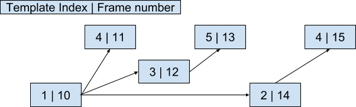
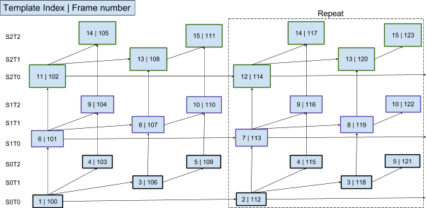
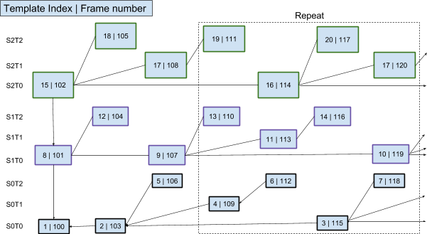

# Dependency Descriptor RTP Header Extension (v0.1)

{:.no_toc }

**Status:** Generic RTP RTC SG Proposal

## Abstract

{:.no_toc }

This specification describes an RTP header extension format for conveying information about individual video frames and the dependencies between these frames independent of the underlying video codec. This extension may be used as an integral part of a codec-specific method to transport a video bitstream over RTP. The Dependency Descriptor RTP Header Extension has wide applicability, from low bit-rate peer-to-peer usage, to high bit-rate multi-party video conferencing. It includes provisions for both temporal and spatial scalability.

## Contents

{:.no_toc }

*   TOC {:toc}

## 1. Introduction

This specification defines the Dependency Descriptor RTP Header Extension (DD) applicable to the transmission of video streams.

**TODO** Find a better alternative term to "Rtp frame".

In the DD, the smallest unit for which dependencies are described is an RTP Frame. An RTP frame contains one complete coded video frame and may also contain additional information (e.g., metadata). This specification allows for fragmentation of RTP Frames over multiple packets. RTP frame aggregation is explicitly disallowed.

To facilitate the work of selectively forwarding portions of a scalable video
bitstream to each endpoint in a video conference, as is done by a Selective
Forwarding Unit (SFU), for each packet, several pieces of information are
required (e.g., spatial and temporal layer identification). To reduce overhead,
highly redundant information can be predefined and sent once. Subsequent packets
may index to a template containing predefined information. In particular, when
an encoder uses an unchanging (static) prediction structure to encode a scalable
bitstream, parameter values used to describe the bitstream repeat in a
predictable way. The techniques described in this document provide means to send
repeating information as predefined templates that can be referenced at future
points of the bitstream. Since a reference index to a template requires fewer
bits to convey than the associated structures themselves, header overhead can be
substantially reduced.

The techniques also provide ways to describe changing (dynamic) prediction
structures. In cases where custom dependency information is required, parameter
values are explicitly defined rather than referenced in a predefined template.
Typically, even in dynamic structures the majority of frames still follow one of
the predefined templates.

## 2. Conventions, definitions and acronyms

The key words "MUST", "MUST NOT", "REQUIRED", "SHALL", "SHALL NOT", "SHOULD",
"SHOULD NOT", "RECOMMENDED", "MAY", and "OPTIONAL" in this document are to be
interpreted as described in [RFC2119].

Chain
: A sequence of frames for which it can be determined instantly if a frame from
  that sequence has been lost.

Coded frame
: The representation of one frame before the decoding process.

Decode target
: The set of frames needed to decode a coded video sequence at a given spatial
  and temporal fidelity.

Decode Target Information (DTI)
: Describes the relationship of a frame to a Decode target. The DTI indicates
  four distinct relationships: 'not present, 'discardable', 'switch indication',
  and 'required'.

Discardable
: An indication for a frame, associated with a given Decode target, that it will
  not be a Referred frame for any frame belonging to that Decode target.

**Note:** A Frame belonging to more than one Decode target may be Discardable
for one Decode target and not for another.
{:.alert .alert-info }

Frame
: A frame in this document is synonymous to a Coded frame.

**Note:** In contrast, in [AV1], Frame is defined as the representation of
video signals in the spatial domain.
{:.alert .alert-info }

**Note:** Multiple frames may be present at the same instant in time.
{:.alert .alert-info }

Frame dependency structure
: Describes frame dependency information for the coded video sequence. The
  structure includes the number of DTIs, an ordered list of Frame dependency
  templates, and a mapping between Chains and Decode targets.

Frame dependency template
: Contains frame description information that many frames have in common.
  Includes values for spatial ID, temporal ID, DTIs, frame dependencies, and
  Chain information.

Frame number
: Frame number increases strictly monotonically in decode order.

**Note:** Frame number is not the same as Frame ID in [AV1 specification].
{:.alert .alert-info }

Instantaneous Decidability of Decodability (IDD)
: The ability to decide, immediately upon receiving the very first packet after
  packet loss, if the lost packet(s) contained a packet that is needed to decode
  the information present in that first and following packets.

Predefined frame
: A Frame for which the spatial ID, temporal ID, DTIs, Referred frames, and
  Chain information is contained in the template_dependency_structure and
  referenced using frame_dependency_template_id.

Referred frame
: A Frame on which the current frame depends.

Required
: An indication for a frame, associated with a given Decode target, that it
  belongs to the Decode target and has neither a Discardable nor a Switch
  indication.

**Note:** A Frame belonging to more than one Decode target may be Required
for one Decode target and not Required (i.e, either Discardable or Switch)
for another.
{:.alert .alert-info }

[Selective Forwarding Unit] (SFU)
: A middlebox that relays streams among transmitting and receiving clients by
  selectively forwarding packets ([RFC7667]).

Switch indication
: An indication associated with a specific Decode target that all subsequent
  frames for that Decode target will be decodable if the frame containing the
  indication is decodable.

Self-defined frame
: A Frame for which the DTIs, Referred frames, and/or Chain information is
  present in the packet(s) containing the Frame.

Switch request
: A request for the encoder to produce a frame with Switch indication that would
  allow the endpoint to decode a specified Decode target.

**TODO**: remove unused definitions.

## 3. Media stream requirements
A bitstream conformant to this extension must adhere to the following statement(s).

A frame for which all Referred frames are decodable MUST itself be decodable.

**Note:** dependencies are not limited to motion compensated prediction, other relevant information such as entropy decoder state also constitute dependencies.

## 4 Dependency Descriptor format

To facilitate the work of selectively forwarding portions of a scalable video
bitstream, as is done by a selective forwarding unit (SFU), for each packet, the
following information is made available (even though not all elements are
present in every packet).

  * spatial ID
  * temporal ID
  * DTIs
  * Frame number of the current frame
  * Frame numbers of the Referred frames
  * Frame numbers of last frame in each Chain

### 4.1 Syntax

The syntax for the descriptor is described in pseudo-code form in this
section.

*   **f(n)** - unsigned n-bit number appearing directly in the bitstream.
*   **ns(n)** - unsigned encoded integer with maximum number of values n (i.e.
    output in range 0..n-1).

(See AV1 specification Section 4 for syntax details including the two functions
above)

| Symbol name               | Value | Description                                         |
| ------------------------- | ----- | --------------------------------------------------- |
| EXTENDED_HEADER_INDICATOR | 63    | Value indicating presence of extended_header
| MAX_TEMPLATE_ID           | 62    | Maximum value for a frame_dependency_template_id to identify a template
| MAX_SPATIAL_ID            | 3     | Maximum value for a FrameSpatialId
| MAX_TEMPORAL_ID           | 7     | Maximum value for a FrameTemporalId
{:.table .table-sm .table-bordered }

Table 1. Syntax constants {: .caption }

<pre><code>
dependency_desriptor() {
  mandatory_descriptor_fields()
  if (frame_dependency_template_id_or_extended_fields_indicator ==
      EXTENDED_FIELDS_INDICATOR) {
    extended_descriptor_fields()
  } else {
    no_extended_descriptor_fields()
  }
  frame_dependency_definition()
}
</code></pre>

<pre><code>
mandatory_descriptor_fields() {
  <b>start_of_frame</b> = f(1)
  <b>end_of_frame</b> = f(1)
  <b>frame_dependency_template_id_or_extended_fields_indicator</b> = f(6)
  <b>frame_number</b> = f(16)
}
</code></pre>

<pre><code>
extended_descriptor_fields() {
  <b>frame_dependency_template_id</b> = f(6)
  <b>template_dependency_structure_present_flag</b> = f(1)
  <b>custom_dtis_flag</b> = f(1)
  <b>custom_fdiffs_flag</b> = f(1)
  <b>custom_chains_flag</b> = f(1)

  if (template_dependency_structure_present_flag) {
    template_dependency_structure()
  }
}
</code></pre>

<pre><code>
no_extended_descriptor_fields() {
  frame_dependency_template_id =
    frame_dependency_template_id_or_extended_fields_indicator
  custom_dtis_flag = 0
  custom_fdiffs_flag = 0
  custom_chains_flag = 0
}
</code></pre>

<pre><code>
template_dependency_structure() {
  <b>template_id_offset</b> = f(6)
  <b>dtis_cnt_minus_one</b> = f(5)
  DtisCnt = dtis_cnt_minus_one + 1
  template_layers()
  template_dtis()
  template_fdiffs()
  template_chains()
  <b>resolutions_present_flag</b> = f(1)
  if (resolutions_present_flag) {
    render_resolutions()
  }
}
</code></pre>

<pre><code>
frame_dependency_definition() {
  templateIndex = (frame_dependency_template_id + (MAX_TEMPLATE_ID + 1) -
                   template_id_offset) % (MAX_TEMPLATE_ID + 1)
  If (templateIndex >= TemplatesCnt) {
    return  // error
  }
  FrameSpatialId = TemplateSpatialId[templateIndex]
  FrameTemporalId = TemplateTemporalId[templateIndex]

  if (custom_dtis_flag) {
    frame_dtis()
  } else {
    frame_dti = template_dti[templateIndex]
  }

  if (custom_fdiffs_flag) {
    frame_fdiffs()
  } else {
    FrameFdiffsCnt = TemplateFdiffsCnt[templateIndex]
    FrameFdiff = TemplateFdiff[templateIndex]
  }

  if (custom_chains_flag) {
    frame_chains()
  } else {
    frame_chain_fdiff = template_chain_fdiff[templateIndex]
  }

  if (resolutions_present_flag) {
    FrameMaxWidth = max_render_width_minus_one[FrameSpatialId] + 1
    FrameMaxHeight = max_render_height_minus_one[FrameSpatialId] + 1
  }
}
</code></pre>

<pre><code>
template_layers() {
  temporalId = 0
  spatialId = 0
  TemplatesCnt = 0;
  MaxTemporalId = 0
  do {
    TemplateSpatialId[TemplatesCnt] = spatialId
    TemplateTemporalId[TemplatesCnt] = temporalId
    TemplatesCnt++
    <b>next_layer_idc</b> = f(2)
    // next_layer_idc == 0 - same sid and tid
    if (next_layer_idc == 1) {
      temporalId++
      if (temporalId > MaxTemporalId) {
        MaxTemporalId = temporalId
      }
    } else if (next_layer_idc == 2) {
      temporalId = 0
      spatialId++
    }
  } while (next_layer_idc != 3)
  MaxSpatialId = spatialId[c]
}
</code></pre>

<pre><code>
render_resolutions() {
  for (spatial_id = 0; spatial_id <= MaxSpatialId; spatial_id++) {
    <b>max_render_width_minus_1[spatial_id]</b> = f(16)
    <b>max_render_height_minus_1[spatial_id]</b> = f(16)
  }
}
</code></pre>

<pre><code>
template_dtis() {
  for (templateIndex = 0; templateIndex < TemplatesCnt; templateIndex++) {
    for (dtiIndex = 0; dtiIndex < DtisCnt; dtiIndex++) {
      // See table 2 below for meaning of DTI values.
      <b>template_dti[templateIndex][dtiIndex]</b> = f(2)
    }
  }
}
</code></pre>

<pre><code>
frame_dtis() {
  for (dtiIndex = 0; dtiIndex < DtisCnt; dtiIndex++) {
    // See table 2 below for meaning of DTI values.
    <b>frame_dti[dtiIndex]</b> = f(2)
  }
}
</code></pre>

<pre><code>
template_fdiffs() {
  templateIndex = 0
  while (templateIndex < TemplatesCnt) {
    fdiffsCnt = 0
    <b>fdiff_follows_flag</b> = f(1)
    while (fdiff_follows_flag) {
      <b>fdiff_minus_one</b> = f(4)
      TemplateFdiff[templateIndex][fdiffsCnt] = fdiff_minus_one + 1
      fdiffsCnt++
      <b>fdiff_follows_flag</b> = f(1)
    }
    TemplateFdiffsCnt[templateIndex] = fdiffsCnt
  }
}
</code></pre>

<pre><code>
frame_fdiffs() {
  FrameFdiffsCnt = 0
  <b>next_fdiff_size</b> = f(2)
  while (next_fdiff_size) {
    <b>fdiff_minus_one</b> = f(4 * next_fdiff_size)
    FrameFdiff[FrameFdiffsCnt] = fdiff_minus_one + 1
    FrameFdiffsCnt++
    <b>next_fdiff_size</b> = f(2)
  }
}
</code></pre>

<pre><code>
template_chains() {
  <b>chains_cnt</b> = ns(DtisCnt + 1)
  if (chains_cnt == 0) {
    return
  }
  for (dtiIndex = 0; dtiIndex < DtisCnt; dtiIndex++) {
    // If a decode target is not tracked by a chain, it will have
    // chain id equal to chains_cnt.
    <b>decode_target_protected_by[dtiIndex]</b> = ns(chains_cnt + 1)
  }
  for (templateIndex = 0; templateIndex < TemplatesCnt; templateIndex++) {
    for (chainIndex = 0; chainIndex < chains_cnt; chainIndex++) {
      <b>template_chain_fdiff[templateIndex][chainIndex]</b> = f(4)
    }
  }
}
</code></pre>

<pre><code>
frame_chains() {
  for (chainIndex = 0; chainIndex < chains_cnt; chainIndex++) {
    <b>frame_chain_fdiff[chainIndex]</b> = f(8)
  }
}
</code></pre>

### 4.2 Semantics

The semantics pertaining to the dependency descriptor syntax section above is
described in this section.

**Mandatory descriptor fields**

*   **start_of_frame**: MUST be set to 1 if the first payload octet of the RTP
    packet is the beginning of a new Frame, and MUST be set to 0 otherwise. Note
    that this frame might not be the first frame of a temporal unit.

*   **end_of_frame**: MUST be set to 1 for the final RTP packet of a Frame, and
    MUST be set to 0 otherwise. Note that, if spatial scalability is in use,
    more frames from the same temporal unit may follow.

*   **frame_number**: is represented using 16 bits and increases strictly
    monotonically in decode order. frame_number MAY start on a random number,
    and MUST wrap after reaching the maximum value. All packets of the same
    Frame MUST have the same frame_number value.

*   **frame_dependency_template_id**: ID of the Frame dependency template to
    use. MUST be in the range of template_id_offset to (template_id_offset +
    TemplatesCnt - 1), inclusive.

    frame_dependency_template_id MUST be the same for all packets of the same
    Frame.

    **Note:** values out of the valid range indicate a change of the Frame
    dependency structure. {:.alert .alert-info }

*   **frame_dependency_template_id_or_extended_fields_indicator**: when equal to
    EXTENDED_FIELDS_INDICATOR, extended_descriptor_fields MUST be present. Otherwise,
    extended_descriptor_fields MUST NOT be present.

**Extended descriptor fields**

*   **template_dependency_structure_present_flag**: indicates the presence the
    template_dependency_structure. When the
    template_dependency_structure_present_flag is set to 1,
    template_dependency_structure MUST be present; otherwise
    template_dependency_structure MUST NOT be present.

*   **custom_dtis_flag**: indicates the presence the frame_dtis. When set to 1,
    frame_dtis MUST be present. Otherwise, frame_dtis MUST NOT be present.

*   **custom_fdiffs_flag**: indicates the presence the frame_fdiffs. When set to
    1, frame_dtis MUST be present. Otherwise, frame_fdiffs MUST NOT be present.

*   **custom_chains_flag**: indicates the presence the frame_chain_fdiff. When
    set to 1, frame_dtis MUST be present. Otherwise, frame_chain_fdiff MUST NOT
    be present.

**Template dependency structure**

*   **template_id_offset**: indicates the value of the
    frame_dependency_template_id having templateIndex=0. The value of
    template_id_offset SHOULD be chosen so that the valid
    frame_dependency_template_id range, template_id_offset to
    template_id_offset + TemplatesCnt - 1, inclusive, of a new
    template_dependency_structure, does not overlap the valid
    frame_dependency_template_id range for the existing
    template_dependency_structure. When template_id_offset of a new
    template_dependency_structure is the same as in the existing
    template_dependency_structure, all fields in both
    template_dependency_structures MUST have identical values.

*   **dtis_cnt_minus_one**: dtis_cnt_minus_one + 1 indicates the number of
    Decode targets present in the coded video sequence.

*   **resolutions_present_flag**: indicates the presence of render_resolutions.
    When the resolutions_present_flag is set to 1, render_resolutions MUST be
    present; otherwise render_resolutions MUST NOT be present.

*   **next_layer_idc**: used to determine spatial ID and temporal ID for the
    next Frame dependency template. Table 3 describes how the spatial ID and
    temporal ID values are determined. A next_layer_idc equal to 3 indicates
    that no more Frame dependency templates are present in the Frame dependency
    structure.

*   **max_render_width_minus_1[spatial_id]**: indicates the maximum render width
    minus 1 for frames with spatial ID equal to spatial_id.

*   **max_render_height_minus_1[spatial_id]**: indicates the maximum render
    height minus 1 for frames with spatial ID equal to spatial_id.

*   **chains_cnt**: indicates the number of Chains. When set to zero, the Frame
    dependency structure does not utilize protection with Chains.

*   **decode_target_protected_by[dtIndex]**: the index of the Chain that
    protects the Decode target, dtIndex. A value of
    decode_target_protected_by[dtIndex] equal to chains_cnt indicates that
    Decode target dtIndex is not protected by a Chain. Each Decode target MAY be
    protected by at most one Chain.

*   **template_dti[templateIndex][]**: an array of size dtis_cnt_minus_one + 1
    containing Decode target information for the Frame dependency template
    having index value equal to templateIndex. Table 2 contains a description of
    the Decode target information values.

*   **template_chain_fdiff[templateIndex][]**: an array of size chains_cnt
    containing chain-FDIFF values for the Frame dependency template having index
    value equal to templateIndex. In a template, the values of chain-FDIFF can
    be in the range 0 to 15, inclusive.

*   **fdiff_follows_flag**: indicates the presence of a frame difference value.
    When the fdiff_follows_flag is set to 1, fdiff_minus_one MUST immediately
    follow; otherwise a value of 0 indicates no more frame difference values are
    present for the current Frame dependency template.

*   **fdiff_minus_one**: the difference between Frame number and the Frame
    number of the Referred frame minus one.

| DTI               | Value |                                                        |
| ----------------- | ----- | ------------------------------------------------------ |
| Not present       | 0     | No payload for this Decode target is present.
| Discardable       | 1     | Payload for this Decode target is present and discardable.
| Switch indication | 2   | Payload for this Decode target is present and switch is possible (Switch indication).
| Required          | 3   | Payload for this Decode target is present but it is neither discardable nor is it a Switch indication.
{:.table .table-sm .table-bordered }

Table 2. DTI values. {: .caption }

**Frame dependency definition**

*   **next_fdiff_size**: indicates the size of following fdiff_minus_one syntax
    elements in 4-bit units. When set to a non-zero value, fdiff_minus_one MUST
    immediately follow; otherwise a value of 0 indicates no more frame
    difference values are present for the current Self-defined frame.

*   **frame_dti[dtiIndex]**: decode target information describing the
    relationship between the current frame and the Decode target having index
    equal to dtiIndex. Table 2 contains a description of the Decode target
    information values.

*   **frame_chain_fdiff[chainIdx]**: indicates the difference between the Frame
    number and the Frame number of the previous frame in the Chain having index
    equal to chainIdx. A value of 0 indicates no previous frames are needed for
    the Chain. For example, when a packet containing
    frame_chain_fdiff[chainIdx]=3 and Frame number=112 the previous frame in the
    Chain with index equal to chainIdx has Frame number=109. The calculation is
    done modulo the size of the frame_number field.

| next_layer_idc | Next Spatial ID And Temporal ID Values                   |
| -------------- | -------------------------------------------------------- |
| 0              | The next Frame dependency template has the same spatial ID and temporal ID as the current template
| 1              | The next Frame dependency template has the same spatial ID and temporal ID plus 1 compared with the current Frame dependency template.
| 2              | The next Frame dependency template has temporal ID equal to 0 and spatial ID plus 1 compared with the current Frame dependency template.
| 3              | No more Frame dependency templates are present in the Frame dependency structure.
{:.table .table-sm .table-bordered }

Table 3. Derivation Of Next Spatial ID And Temporal ID Values. {: .caption }

**TODO:** Add process descriptions and examples. {:.alert .alert-danger }

#### 4.3 Implementing IDD with Chains

The Frame dependency structure includes a mapping between Decode targets and
Chains. The mapping gives an SFU the ability to know the set of Chains it needs
to track in order to ensure that the corresponding Decode targets remain
decodable. Every packet includes, for every Chain, the Frame number for the
previous Frame in that Chain. An SFU can instantaneously detect a broken Chain
by checking whether or not the previous Frame in that Chain has been received.
Due to the fact that Chain information for all Chains is present in all packets,
an SFU can detect a broken Chain regardless of whether the first packet received
after a loss is part of that Chain.

In order to start/restart Chains, a packet may reference its own Frame number as
an indication that no previous Frames are needed for the Chain. Key frames are
common cases for such '(re)start of Chain' indications.

**Note:** Chains may be used for more than just realizing the IDD property.
{:.alert .alert-info }

#### 4.4 Switching

An SFU may begin forwarding packets belonging to a new Decode target beginning
with a decodable Frame containing a Switch indication to that Decode target.

## 5. Examples

Each example in this section contains a prediction structure figure and a table
describing the associated Frame dependency structure. The Frame dependency
structure table column headings have the meanings listed below. For the DTI-
related columns, Table 4 shows the symbol used to represent each DTI value.

*   Idx - template index
*   S - spatial ID
*   T - temporal ID
*   Fdiffs - comma delimited list of TemplateFdiff[Idx] values
*   Chain(s) - **template_chain_fdiff[Idx]** values for each Chain
*   DTI - **template_dti[Idx]**

DTI               | Value | Symbol
----------------- | ----- | ------
Not present       | 0     | -
Discardable       | 1     | D
Switch indication | 2     | S
Required          | 3     | R
{:.table .table-sm .table-bordered }

Table 4. DTI values {: .caption }

### 5.1 L1T3 Single spatial layer with 3 temporal layers

<figure class="figure center-block" style="display: table; margin: 1.5em auto;">
  
</figure>

<table class="table-sm table-bordered" style="margin-bottom: 1.5em;">
<tbody><tr>
<th colspan='1' rowspan='2' >Idx</th><th colspan='1' rowspan='2' >S</th><th colspan='1' rowspan='2' >T</th><th colspan='1' rowspan='2' >Fdiffs</th><th colspan='1' rowspan='2' >Chain</th><th colspan='3' rowspan='1' >DTI</th>
</tr>
<tr>
<th colspan='1' rowspan='1' >30 fps</th><th colspan='1' rowspan='1' >15 fps</th><th colspan='1' rowspan='1' >7.5 fps</th>
</tr>
<tr>
<td colspan='1' rowspan='1' >1</td><td colspan='1' rowspan='1' >0</td><td colspan='1' rowspan='1' >0</td><td colspan='1' rowspan='1' ></td><td colspan='1' rowspan='1' >0</td><td colspan='1' rowspan='1' >S</td><td colspan='1' rowspan='1' >S</td><td colspan='1' rowspan='1' >S</td>
</tr>
<tr>
<td colspan='1' rowspan='1' >2</td><td colspan='1' rowspan='1' >0</td><td colspan='1' rowspan='1' >0</td><td colspan='1' rowspan='1' >4</td><td colspan='1' rowspan='1' >4</td><td colspan='1' rowspan='1' >S</td><td colspan='1' rowspan='1' >S</td><td colspan='1' rowspan='1' >S</td>
</tr>
<tr>
<td colspan='1' rowspan='1' >3</td><td colspan='1' rowspan='1' >0</td><td colspan='1' rowspan='1' >1</td><td colspan='1' rowspan='1' >2</td><td colspan='1' rowspan='1' >2</td><td colspan='1' rowspan='1' >S</td><td colspan='1' rowspan='1' >D</td><td colspan='1' rowspan='1' >-</td>
</tr>
<tr>
<td colspan='1' rowspan='1' >4</td><td colspan='1' rowspan='1' >0</td><td colspan='1' rowspan='1' >2</td><td colspan='1' rowspan='1' >1</td><td colspan='1' rowspan='1' >1</td><td colspan='1' rowspan='1' >D</td><td colspan='1' rowspan='1' >-</td><td colspan='1' rowspan='1' >-</td>
</tr>
<tr>
<td colspan='1' rowspan='1' >5</td><td colspan='1' rowspan='1' >0</td><td colspan='1' rowspan='1' >2</td><td colspan='1' rowspan='1' >1</td><td colspan='1' rowspan='1' >3</td><td colspan='1' rowspan='1' >D</td><td colspan='1' rowspan='1' >-</td><td colspan='1' rowspan='1' >-</td>
</tr>
<tr>
<td colspan='5' rowspan='1' ><b><tt>decode_target_protected_by</tt></b></td><td colspan='1' rowspan='1' >0</td><td colspan='1' rowspan='1' >0</td><td colspan='1' rowspan='1' >0</td>
</tr>
</tbody></table>

**Note:** This example uses one Chain, which includes Frames with temporal ID
equal to 0. {:.alert .alert-info }

### 5.2 L2T1 Full SVC with occasional switch

<figure class="figure center-block" style="display: table; margin: 1.5em auto;">
  
</figure>

<table class="table-sm table-bordered" style="margin-bottom: 1.5em;">
<tbody><tr>
<th colspan='1' rowspan='2' >Idx</th><th colspan='1' rowspan='2' >S</th><th colspan='1' rowspan='2' >T</th><th colspan='1' rowspan='2' >Fdiffs</th><th colspan='2' rowspan='1' >Chains</th><th colspan='2' rowspan='1' >DTI</th>
</tr>
<tr>
<th colspan='1' rowspan='1' >0</th><th colspan='1' rowspan='1' >1</th><th colspan='1' rowspan='1' >HD</th><th colspan='1' rowspan='1' >VGA</th>
</tr>
<tr>
<td colspan='1' rowspan='1' >1</td><td colspan='1' rowspan='1' >0</td><td colspan='1' rowspan='1' >0</td><td colspan='1' rowspan='1' ></td><td colspan='1' rowspan='1' >0</td><td colspan='1' rowspan='1' >0</td><td colspan='1' rowspan='1' >S</td><td colspan='1' rowspan='1' >S</td>
</tr>
<tr>
<td colspan='1' rowspan='1' >2</td><td colspan='1' rowspan='1' >0</td><td colspan='1' rowspan='1' >0</td><td colspan='1' rowspan='1' >2</td><td colspan='1' rowspan='1' >2</td><td colspan='1' rowspan='1' >1</td><td colspan='1' rowspan='1' >R</td><td colspan='1' rowspan='1' >S</td>
</tr>
<tr>
<td colspan='1' rowspan='1' >3</td><td colspan='1' rowspan='1' >0</td><td colspan='1' rowspan='1' >0</td><td colspan='1' rowspan='1' >2</td><td colspan='1' rowspan='1' >2</td><td colspan='1' rowspan='1' >1</td><td colspan='1' rowspan='1' >S</td><td colspan='1' rowspan='1' >S</td>
</tr>
<tr>
<td colspan='1' rowspan='1' >4</td><td colspan='1' rowspan='1' >1</td><td colspan='1' rowspan='1' >0</td><td colspan='1' rowspan='1' >1</td><td colspan='1' rowspan='1' >1</td><td colspan='1' rowspan='1' >1</td><td colspan='1' rowspan='1' >S</td><td colspan='1' rowspan='1' >-</td>
</tr>
<tr>
<td colspan='1' rowspan='1' >5</td><td colspan='1' rowspan='1' >1</td><td colspan='1' rowspan='1' >0</td><td colspan='1' rowspan='1' >2,1</td><td colspan='1' rowspan='1' >1</td><td colspan='1' rowspan='1' >1</td><td colspan='1' rowspan='1' >R</td><td colspan='1' rowspan='1' >-</td>
</tr>
<tr>
<td colspan='6' rowspan='1' ><b><tt>decode_target_protected_by</tt></b></td><td colspan='1' rowspan='1' >1</td><td colspan='1' rowspan='1' >0</td>
</tr>
</tbody></table>

**Note:** This example uses two Chains. Chain 0 includes Frames with spatial ID
equal to 0. Chain 1 includes all Frames. {:.alert .alert-info }

### 5.3 L3T3 Full SVC

<figure class="figure center-block" style="display: table; margin: 1.5em auto;">
  
</figure>

<table class="table-sm table-bordered" style="margin-bottom: 1.5em;">
<tbody><tr>
<th colspan='1' rowspan='2' >Idx</th><th colspan='1' rowspan='2' >S</th><th colspan='1' rowspan='2' >T</th><th colspan='1' rowspan='2' >Fdiffs</th><th colspan='3' rowspan='1' >Chains</th><th colspan='9' rowspan='1' >DTI</th>
</tr>
<tr>
<th colspan='1' rowspan='1' >0</th><th colspan='1' rowspan='1' >1</th><th colspan='1' rowspan='1' >2</th><th colspan='1' rowspan='1' >HD30 fps</th><th colspan='1' rowspan='1' >HD15 fps</th><th colspan='1' rowspan='1' >HD7.5 fps</th><th colspan='1' rowspan='1' >VGA30 fps</th><th colspan='1' rowspan='1' >VGA15 fps</th><th colspan='1' rowspan='1' >VGA7.5fps</th><th colspan='1' rowspan='1' >QVGA30 fps</th><th colspan='1' rowspan='1' >QVGA15 fps</th><th colspan='1' rowspan='1' >QVGA7.5 fps</th><th colspan='1' rowspan='1' ></th>
</tr>
<tr>
<td colspan='1' rowspan='1' >1</td><td colspan='1' rowspan='1' >0</td><td colspan='1' rowspan='1' >0</td><td colspan='1' rowspan='1' ></td><td colspan='1' rowspan='1' >0</td><td colspan='1' rowspan='1' >0</td><td colspan='1' rowspan='1' >0</td><td colspan='1' rowspan='1' >S</td><td colspan='1' rowspan='1' >S</td><td colspan='1' rowspan='1' >S</td><td colspan='1' rowspan='1' >S</td><td colspan='1' rowspan='1' >S</td><td colspan='1' rowspan='1' >S</td><td colspan='1' rowspan='1' >S</td><td colspan='1' rowspan='1' >S</td><td colspan='1' rowspan='1' >S</td>
</tr>
<tr>
<td colspan='1' rowspan='1' >2</td><td colspan='1' rowspan='1' >0</td><td colspan='1' rowspan='1' >0</td><td colspan='1' rowspan='1' >12</td><td colspan='1' rowspan='1' >12</td><td colspan='1' rowspan='1' >11</td><td colspan='1' rowspan='1' >10</td><td colspan='1' rowspan='1' >R</td><td colspan='1' rowspan='1' >R</td><td colspan='1' rowspan='1' >R</td><td colspan='1' rowspan='1' >R</td><td colspan='1' rowspan='1' >R</td><td colspan='1' rowspan='1' >R</td><td colspan='1' rowspan='1' >S</td><td colspan='1' rowspan='1' >S</td><td colspan='1' rowspan='1' >S</td>
</tr>
<tr>
<td colspan='1' rowspan='1' >3</td><td colspan='1' rowspan='1' >0</td><td colspan='1' rowspan='1' >1</td><td colspan='1' rowspan='1' >6</td><td colspan='1' rowspan='1' >6</td><td colspan='1' rowspan='1' >5</td><td colspan='1' rowspan='1' >4</td><td colspan='1' rowspan='1' >R</td><td colspan='1' rowspan='1' >R</td><td colspan='1' rowspan='1' >-</td><td colspan='1' rowspan='1' >R</td><td colspan='1' rowspan='1' >R</td><td colspan='1' rowspan='1' >-</td><td colspan='1' rowspan='1' >S</td><td colspan='1' rowspan='1' >D</td><td colspan='1' rowspan='1' >-</td>
</tr>
<tr>
<td colspan='1' rowspan='1' >4</td><td colspan='1' rowspan='1' >0</td><td colspan='1' rowspan='1' >2</td><td colspan='1' rowspan='1' >3</td><td colspan='1' rowspan='1' >3</td><td colspan='1' rowspan='1' >2</td><td colspan='1' rowspan='1' >1</td><td colspan='1' rowspan='1' >R</td><td colspan='1' rowspan='1' >-</td><td colspan='1' rowspan='1' >-</td><td colspan='1' rowspan='1' >R</td><td colspan='1' rowspan='1' >-</td><td colspan='1' rowspan='1' >-</td><td colspan='1' rowspan='1' >D</td><td colspan='1' rowspan='1' >-</td><td colspan='1' rowspan='1' >-</td>
</tr>
<tr>
<td colspan='1' rowspan='1' >5</td><td colspan='1' rowspan='1' >0</td><td colspan='1' rowspan='1' >2</td><td colspan='1' rowspan='1' >3</td><td colspan='1' rowspan='1' >9</td><td colspan='1' rowspan='1' >8</td><td colspan='1' rowspan='1' >7</td><td colspan='1' rowspan='1' >R</td><td colspan='1' rowspan='1' >-</td><td colspan='1' rowspan='1' >-</td><td colspan='1' rowspan='1' >R</td><td colspan='1' rowspan='1' >-</td><td colspan='1' rowspan='1' >-</td><td colspan='1' rowspan='1' >D</td><td colspan='1' rowspan='1' >-</td><td colspan='1' rowspan='1' >-</td>
</tr>
<tr>
<td colspan='1' rowspan='1' >6</td><td colspan='1' rowspan='1' >1</td><td colspan='1' rowspan='1' >0</td><td colspan='1' rowspan='1' >1</td><td colspan='1' rowspan='1' >1</td><td colspan='1' rowspan='1' >1</td><td colspan='1' rowspan='1' >1</td><td colspan='1' rowspan='1' >S</td><td colspan='1' rowspan='1' >S</td><td colspan='1' rowspan='1' >S</td><td colspan='1' rowspan='1' >S</td><td colspan='1' rowspan='1' >S</td><td colspan='1' rowspan='1' >S</td><td colspan='1' rowspan='1' >-</td><td colspan='1' rowspan='1' >-</td><td colspan='1' rowspan='1' >-</td>
</tr>
<tr>
<td colspan='1' rowspan='1' >7</td><td colspan='1' rowspan='1' >1</td><td colspan='1' rowspan='1' >0</td><td colspan='1' rowspan='1' >12,1</td><td colspan='1' rowspan='1' >1</td><td colspan='1' rowspan='1' >1</td><td colspan='1' rowspan='1' >1</td><td colspan='1' rowspan='1' >R</td><td colspan='1' rowspan='1' >R</td><td colspan='1' rowspan='1' >R</td><td colspan='1' rowspan='1' >S</td><td colspan='1' rowspan='1' >S</td><td colspan='1' rowspan='1' >S</td><td colspan='1' rowspan='1' >-</td><td colspan='1' rowspan='1' >-</td><td colspan='1' rowspan='1' >-</td>
</tr>
<tr>
<td colspan='1' rowspan='1' >8</td><td colspan='1' rowspan='1' >1</td><td colspan='1' rowspan='1' >1</td><td colspan='1' rowspan='1' >6,1</td><td colspan='1' rowspan='1' >7</td><td colspan='1' rowspan='1' >6</td><td colspan='1' rowspan='1' >5</td><td colspan='1' rowspan='1' >R</td><td colspan='1' rowspan='1' >R</td><td colspan='1' rowspan='1' >-</td><td colspan='1' rowspan='1' >S</td><td colspan='1' rowspan='1' >D</td><td colspan='1' rowspan='1' >-</td><td colspan='1' rowspan='1' >-</td><td colspan='1' rowspan='1' >-</td><td colspan='1' rowspan='1' >-</td>
</tr>
<tr>
<td colspan='1' rowspan='1' >9</td><td colspan='1' rowspan='1' >1</td><td colspan='1' rowspan='1' >2</td><td colspan='1' rowspan='1' >3,1</td><td colspan='1' rowspan='1' >4</td><td colspan='1' rowspan='1' >3</td><td colspan='1' rowspan='1' >2</td><td colspan='1' rowspan='1' >R</td><td colspan='1' rowspan='1' >-</td><td colspan='1' rowspan='1' >-</td><td colspan='1' rowspan='1' >D</td><td colspan='1' rowspan='1' >-</td><td colspan='1' rowspan='1' >-</td><td colspan='1' rowspan='1' >-</td><td colspan='1' rowspan='1' >-</td><td colspan='1' rowspan='1' >-</td>
</tr>
<tr>
<td colspan='1' rowspan='1' >10</td><td colspan='1' rowspan='1' >1</td><td colspan='1' rowspan='1' >2</td><td colspan='1' rowspan='1' >3,1</td><td colspan='1' rowspan='1' >10</td><td colspan='1' rowspan='1' >9</td><td colspan='1' rowspan='1' >8</td><td colspan='1' rowspan='1' >R</td><td colspan='1' rowspan='1' >-</td><td colspan='1' rowspan='1' >-</td><td colspan='1' rowspan='1' >D</td><td colspan='1' rowspan='1' >-</td><td colspan='1' rowspan='1' >-</td><td colspan='1' rowspan='1' >-</td><td colspan='1' rowspan='1' >-</td><td colspan='1' rowspan='1' >-</td>
</tr>
<tr>
<td colspan='1' rowspan='1' >11</td><td colspan='1' rowspan='1' >2</td><td colspan='1' rowspan='1' >0</td><td colspan='1' rowspan='1' >1</td><td colspan='1' rowspan='1' >2</td><td colspan='1' rowspan='1' >1</td><td colspan='1' rowspan='1' >1</td><td colspan='1' rowspan='1' >S</td><td colspan='1' rowspan='1' >S</td><td colspan='1' rowspan='1' >S</td><td colspan='1' rowspan='1' >-</td><td colspan='1' rowspan='1' >-</td><td colspan='1' rowspan='1' >-</td><td colspan='1' rowspan='1' >-</td><td colspan='1' rowspan='1' >-</td><td colspan='1' rowspan='1' >-</td>
</tr>
<tr>
<td colspan='1' rowspan='1' >12</td><td colspan='1' rowspan='1' >2</td><td colspan='1' rowspan='1' >0</td><td colspan='1' rowspan='1' >12,1</td><td colspan='1' rowspan='1' >2</td><td colspan='1' rowspan='1' >1</td><td colspan='1' rowspan='1' >1</td><td colspan='1' rowspan='1' >S</td><td colspan='1' rowspan='1' >S</td><td colspan='1' rowspan='1' >S</td><td colspan='1' rowspan='1' >-</td><td colspan='1' rowspan='1' >-</td><td colspan='1' rowspan='1' >-</td><td colspan='1' rowspan='1' >-</td><td colspan='1' rowspan='1' >-</td><td colspan='1' rowspan='1' >-</td>
</tr>
<tr>
<td colspan='1' rowspan='1' >13</td><td colspan='1' rowspan='1' >2</td><td colspan='1' rowspan='1' >1</td><td colspan='1' rowspan='1' >6,1</td><td colspan='1' rowspan='1' >8</td><td colspan='1' rowspan='1' >7</td><td colspan='1' rowspan='1' >6</td><td colspan='1' rowspan='1' >S</td><td colspan='1' rowspan='1' >D</td><td colspan='1' rowspan='1' >-</td><td colspan='1' rowspan='1' >-</td><td colspan='1' rowspan='1' >-</td><td colspan='1' rowspan='1' >-</td><td colspan='1' rowspan='1' >-</td><td colspan='1' rowspan='1' >-</td><td colspan='1' rowspan='1' >-</td>
</tr>
<tr>
<td colspan='1' rowspan='1' >14</td><td colspan='1' rowspan='1' >2</td><td colspan='1' rowspan='1' >2</td><td colspan='1' rowspan='1' >3,1</td><td colspan='1' rowspan='1' >5</td><td colspan='1' rowspan='1' >4</td><td colspan='1' rowspan='1' >3</td><td colspan='1' rowspan='1' >D</td><td colspan='1' rowspan='1' >-</td><td colspan='1' rowspan='1' >-</td><td colspan='1' rowspan='1' >-</td><td colspan='1' rowspan='1' >-</td><td colspan='1' rowspan='1' >-</td><td colspan='1' rowspan='1' >-</td><td colspan='1' rowspan='1' >-</td><td colspan='1' rowspan='1' >-</td>
</tr>
<tr>
<td colspan='1' rowspan='1' >15</td><td colspan='1' rowspan='1' >2</td><td colspan='1' rowspan='1' >2</td><td colspan='1' rowspan='1' >3,1</td><td colspan='1' rowspan='1' >11</td><td colspan='1' rowspan='1' >10</td><td colspan='1' rowspan='1' >9</td><td colspan='1' rowspan='1' >D</td><td colspan='1' rowspan='1' >-</td><td colspan='1' rowspan='1' >-</td><td colspan='1' rowspan='1' >-</td><td colspan='1' rowspan='1' >-</td><td colspan='1' rowspan='1' >-</td><td colspan='1' rowspan='1' >-</td><td colspan='1' rowspan='1' >-</td><td colspan='1' rowspan='1' >-</td>
</tr>
<tr>
<td colspan='7' rowspan='1' ><b><tt>decode_target_protected_by</tt></b></td><td colspan='1' rowspan='1' >2</td><td colspan='1' rowspan='1' >2</td><td colspan='1' rowspan='1' >2</td><td colspan='1' rowspan='1' >1</td><td colspan='1' rowspan='1' >1</td><td colspan='1' rowspan='1' >1</td><td colspan='1' rowspan='1' >0</td><td colspan='1' rowspan='1' >0</td><td colspan='1' rowspan='1' >0</td>
</tr>
</tbody></table>

**Note:** This example uses three Chains. Chain 0 includes Frames with spatial
ID equal to 0 and temporal ID equal to 0. Chain 1 includes Frames with spatial
ID equal to 0 or 1 and temporal ID equal to 0. Chain 2 includes all Frames with
temporal ID equal to 0. {:.alert .alert-info }

### 5.4 S3T3 K-SVC with temporal shift

<figure class="figure center-block" style="display: table; margin: 1.5em auto;">
  
</figure>

<table class="table-sm table-bordered" style="margin-bottom: 1.5em;">
<tbody><tr>
<th colspan='1' rowspan='2' >Idx</th><th colspan='1' rowspan='2' >S</th><th colspan='1' rowspan='2' >T</th><th colspan='1' rowspan='2' >Fdiffs</th><th colspan='3' rowspan='1' >Chains</th><th colspan='9' rowspan='1' >DTI</th>
</tr>
<tr>
<th colspan='1' rowspan='1' >0</th><th colspan='1' rowspan='1' >1</th><th colspan='1' rowspan='1' >2</th><th colspan='1' rowspan='1' >HD 30 fps</th><th colspan='1' rowspan='1' >HD 15 fps</th><th colspan='1' rowspan='1' >HD 7.5 fps</th><th colspan='1' rowspan='1' >VGA 30 fps</th><th colspan='1' rowspan='1' >VGA 15 fps</th><th colspan='1' rowspan='1' >VGA 7.5 fps</th><th colspan='1' rowspan='1' >QVGA 30 fps</th><th colspan='1' rowspan='1' >QVGA 15 fps</th><th colspan='1' rowspan='1' >QVGA 7.5 fps</th><th colspan='1' rowspan='1' ></th>
</tr>
<tr>
<td colspan='1' rowspan='1' >1</td><td colspan='1' rowspan='1' >0</td><td colspan='1' rowspan='1' >0</td><td colspan='1' rowspan='1' ></td><td colspan='1' rowspan='1' >0</td><td colspan='1' rowspan='1' >0</td><td colspan='1' rowspan='1' >0</td><td colspan='1' rowspan='1' >S</td><td colspan='1' rowspan='1' >S</td><td colspan='1' rowspan='1' >S</td><td colspan='1' rowspan='1' >S</td><td colspan='1' rowspan='1' >S</td><td colspan='1' rowspan='1' >S</td><td colspan='1' rowspan='1' >S</td><td colspan='1' rowspan='1' >S</td><td colspan='1' rowspan='1' >S</td>
</tr>
<tr>
<td colspan='1' rowspan='1' >2</td><td colspan='1' rowspan='1' >0</td><td colspan='1' rowspan='1' >0</td><td colspan='1' rowspan='1' >3</td><td colspan='1' rowspan='1' >3</td><td colspan='1' rowspan='1' >2</td><td colspan='1' rowspan='1' >1</td><td colspan='1' rowspan='1' >-</td><td colspan='1' rowspan='1' >-</td><td colspan='1' rowspan='1' >-</td><td colspan='1' rowspan='1' >-</td><td colspan='1' rowspan='1' >-</td><td colspan='1' rowspan='1' >-</td><td colspan='1' rowspan='1' >S</td><td colspan='1' rowspan='1' >S</td><td colspan='1' rowspan='1' >S</td>
</tr>
<tr>
<td colspan='1' rowspan='1' >3</td><td colspan='1' rowspan='1' >0</td><td colspan='1' rowspan='1' >0</td><td colspan='1' rowspan='1' >12</td><td colspan='1' rowspan='1' >12</td><td colspan='1' rowspan='1' >8</td><td colspan='1' rowspan='1' >1</td><td colspan='1' rowspan='1' >-</td><td colspan='1' rowspan='1' >-</td><td colspan='1' rowspan='1' >-</td><td colspan='1' rowspan='1' >-</td><td colspan='1' rowspan='1' >-</td><td colspan='1' rowspan='1' >-</td><td colspan='1' rowspan='1' >S</td><td colspan='1' rowspan='1' >S</td><td colspan='1' rowspan='1' >S</td>
</tr>
<tr>
<td colspan='1' rowspan='1' >4</td><td colspan='1' rowspan='1' >0</td><td colspan='1' rowspan='1' >1</td><td colspan='1' rowspan='1' >6</td><td colspan='1' rowspan='1' >6</td><td colspan='1' rowspan='1' >2</td><td colspan='1' rowspan='1' >7</td><td colspan='1' rowspan='1' >-</td><td colspan='1' rowspan='1' >-</td><td colspan='1' rowspan='1' >-</td><td colspan='1' rowspan='1' >-</td><td colspan='1' rowspan='1' >-</td><td colspan='1' rowspan='1' >-</td><td colspan='1' rowspan='1' >S</td><td colspan='1' rowspan='1' >D</td><td colspan='1' rowspan='1' >-</td>
</tr>
<tr>
<td colspan='1' rowspan='1' >5</td><td colspan='1' rowspan='1' >0</td><td colspan='1' rowspan='1' >2</td><td colspan='1' rowspan='1' >3</td><td colspan='1' rowspan='1' >3</td><td colspan='1' rowspan='1' >5</td><td colspan='1' rowspan='1' >4</td><td colspan='1' rowspan='1' >-</td><td colspan='1' rowspan='1' >-</td><td colspan='1' rowspan='1' >-</td><td colspan='1' rowspan='1' >-</td><td colspan='1' rowspan='1' >-</td><td colspan='1' rowspan='1' >-</td><td colspan='1' rowspan='1' >D</td><td colspan='1' rowspan='1' >-</td><td colspan='1' rowspan='1' >-</td>
</tr>
<tr>
<td colspan='1' rowspan='1' >6</td><td colspan='1' rowspan='1' >0</td><td colspan='1' rowspan='1' >2</td><td colspan='1' rowspan='1' >3</td><td colspan='1' rowspan='1' >9</td><td colspan='1' rowspan='1' >5</td><td colspan='1' rowspan='1' >10</td><td colspan='1' rowspan='1' >-</td><td colspan='1' rowspan='1' >-</td><td colspan='1' rowspan='1' >-</td><td colspan='1' rowspan='1' >-</td><td colspan='1' rowspan='1' >-</td><td colspan='1' rowspan='1' >-</td><td colspan='1' rowspan='1' >D</td><td colspan='1' rowspan='1' >-</td><td colspan='1' rowspan='1' >-</td>
</tr>
<tr>
<td colspan='1' rowspan='1' >7</td><td colspan='1' rowspan='1' >0</td><td colspan='1' rowspan='1' >2</td><td colspan='1' rowspan='1' >3</td><td colspan='1' rowspan='1' >3</td><td colspan='1' rowspan='1' >11</td><td colspan='1' rowspan='1' >4</td><td colspan='1' rowspan='1' >-</td><td colspan='1' rowspan='1' >-</td><td colspan='1' rowspan='1' >-</td><td colspan='1' rowspan='1' >-</td><td colspan='1' rowspan='1' >-</td><td colspan='1' rowspan='1' >-</td><td colspan='1' rowspan='1' >D</td><td colspan='1' rowspan='1' >-</td><td colspan='1' rowspan='1' >-</td>
</tr>
<tr>
<td colspan='1' rowspan='1' >8</td><td colspan='1' rowspan='1' >1</td><td colspan='1' rowspan='1' >0</td><td colspan='1' rowspan='1' >1</td><td colspan='1' rowspan='1' >1</td><td colspan='1' rowspan='1' >1</td><td colspan='1' rowspan='1' >1</td><td colspan='1' rowspan='1' >S</td><td colspan='1' rowspan='1' >S</td><td colspan='1' rowspan='1' >S</td><td colspan='1' rowspan='1' >S</td><td colspan='1' rowspan='1' >S</td><td colspan='1' rowspan='1' >S</td><td colspan='1' rowspan='1' >-</td><td colspan='1' rowspan='1' >-</td><td colspan='1' rowspan='1' >-</td>
</tr>
<tr>
<td colspan='1' rowspan='1' >9</td><td colspan='1' rowspan='1' >1</td><td colspan='1' rowspan='1' >0</td><td colspan='1' rowspan='1' >6</td><td colspan='1' rowspan='1' >4</td><td colspan='1' rowspan='1' >6</td><td colspan='1' rowspan='1' >5</td><td colspan='1' rowspan='1' >-</td><td colspan='1' rowspan='1' >-</td><td colspan='1' rowspan='1' >-</td><td colspan='1' rowspan='1' >S</td><td colspan='1' rowspan='1' >S</td><td colspan='1' rowspan='1' >S</td><td colspan='1' rowspan='1' >-</td><td colspan='1' rowspan='1' >-</td><td colspan='1' rowspan='1' >-</td>
</tr>
<tr>
<td colspan='1' rowspan='1' >10</td><td colspan='1' rowspan='1' >1</td><td colspan='1' rowspan='1' >0</td><td colspan='1' rowspan='1' >12</td><td colspan='1' rowspan='1' >4</td><td colspan='1' rowspan='1' >12</td><td colspan='1' rowspan='1' >5</td><td colspan='1' rowspan='1' >-</td><td colspan='1' rowspan='1' >-</td><td colspan='1' rowspan='1' >-</td><td colspan='1' rowspan='1' >S</td><td colspan='1' rowspan='1' >S</td><td colspan='1' rowspan='1' >S</td><td colspan='1' rowspan='1' >-</td><td colspan='1' rowspan='1' >-</td><td colspan='1' rowspan='1' >-</td>
</tr>
<tr>
<td colspan='1' rowspan='1' >11</td><td colspan='1' rowspan='1' >1</td><td colspan='1' rowspan='1' >1</td><td colspan='1' rowspan='1' >6</td><td colspan='1' rowspan='1' >10</td><td colspan='1' rowspan='1' >6</td><td colspan='1' rowspan='1' >11</td><td colspan='1' rowspan='1' >-</td><td colspan='1' rowspan='1' >-</td><td colspan='1' rowspan='1' >-</td><td colspan='1' rowspan='1' >S</td><td colspan='1' rowspan='1' >D</td><td colspan='1' rowspan='1' >-</td><td colspan='1' rowspan='1' >-</td><td colspan='1' rowspan='1' >-</td><td colspan='1' rowspan='1' >-</td>
</tr>
<tr>
<td colspan='1' rowspan='1' >12</td><td colspan='1' rowspan='1' >1</td><td colspan='1' rowspan='1' >2</td><td colspan='1' rowspan='1' >3</td><td colspan='1' rowspan='1' >1</td><td colspan='1' rowspan='1' >3</td><td colspan='1' rowspan='1' >2</td><td colspan='1' rowspan='1' >-</td><td colspan='1' rowspan='1' >-</td><td colspan='1' rowspan='1' >-</td><td colspan='1' rowspan='1' >D</td><td colspan='1' rowspan='1' >-</td><td colspan='1' rowspan='1' >-</td><td colspan='1' rowspan='1' >-</td><td colspan='1' rowspan='1' >-</td><td colspan='1' rowspan='1' >-</td>
</tr>
<tr>
<td colspan='1' rowspan='1' >13</td><td colspan='1' rowspan='1' >1</td><td colspan='1' rowspan='1' >2</td><td colspan='1' rowspan='1' >3</td><td colspan='1' rowspan='1' >7</td><td colspan='1' rowspan='1' >3</td><td colspan='1' rowspan='1' >8</td><td colspan='1' rowspan='1' >-</td><td colspan='1' rowspan='1' >-</td><td colspan='1' rowspan='1' >-</td><td colspan='1' rowspan='1' >D</td><td colspan='1' rowspan='1' >-</td><td colspan='1' rowspan='1' >-</td><td colspan='1' rowspan='1' >-</td><td colspan='1' rowspan='1' >-</td><td colspan='1' rowspan='1' >-</td>
</tr>
<tr>
<td colspan='1' rowspan='1' >14</td><td colspan='1' rowspan='1' >1</td><td colspan='1' rowspan='1' >2</td><td colspan='1' rowspan='1' >3</td><td colspan='1' rowspan='1' >1</td><td colspan='1' rowspan='1' >9</td><td colspan='1' rowspan='1' >2</td><td colspan='1' rowspan='1' >-</td><td colspan='1' rowspan='1' >-</td><td colspan='1' rowspan='1' >-</td><td colspan='1' rowspan='1' >D</td><td colspan='1' rowspan='1' >-</td><td colspan='1' rowspan='1' >-</td><td colspan='1' rowspan='1' >-</td><td colspan='1' rowspan='1' >-</td><td colspan='1' rowspan='1' >-</td>
</tr>
<tr>
<td colspan='1' rowspan='1' >15</td><td colspan='1' rowspan='1' >2</td><td colspan='1' rowspan='1' >0</td><td colspan='1' rowspan='1' >1</td><td colspan='1' rowspan='1' >2</td><td colspan='1' rowspan='1' >1</td><td colspan='1' rowspan='1' >1</td><td colspan='1' rowspan='1' >S</td><td colspan='1' rowspan='1' >S</td><td colspan='1' rowspan='1' >S</td><td colspan='1' rowspan='1' >-</td><td colspan='1' rowspan='1' >-</td><td colspan='1' rowspan='1' >-</td><td colspan='1' rowspan='1' >-</td><td colspan='1' rowspan='1' >-</td><td colspan='1' rowspan='1' >-</td>
</tr>
<tr>
<td colspan='1' rowspan='1' >16</td><td colspan='1' rowspan='1' >2</td><td colspan='1' rowspan='1' >0</td><td colspan='1' rowspan='1' >12</td><td colspan='1' rowspan='1' >11</td><td colspan='1' rowspan='1' >7</td><td colspan='1' rowspan='1' >12</td><td colspan='1' rowspan='1' >S</td><td colspan='1' rowspan='1' >S</td><td colspan='1' rowspan='1' >S</td><td colspan='1' rowspan='1' >-</td><td colspan='1' rowspan='1' >-</td><td colspan='1' rowspan='1' >-</td><td colspan='1' rowspan='1' >-</td><td colspan='1' rowspan='1' >-</td><td colspan='1' rowspan='1' >-</td>
</tr>
<tr>
<td colspan='1' rowspan='1' >17</td><td colspan='1' rowspan='1' >2</td><td colspan='1' rowspan='1' >1</td><td colspan='1' rowspan='1' >6</td><td colspan='1' rowspan='1' >5</td><td colspan='1' rowspan='1' >1</td><td colspan='1' rowspan='1' >6</td><td colspan='1' rowspan='1' >S</td><td colspan='1' rowspan='1' >D</td><td colspan='1' rowspan='1' >-</td><td colspan='1' rowspan='1' >-</td><td colspan='1' rowspan='1' >-</td><td colspan='1' rowspan='1' >-</td><td colspan='1' rowspan='1' >-</td><td colspan='1' rowspan='1' >-</td><td colspan='1' rowspan='1' >-</td>
</tr>
<tr>
<td colspan='1' rowspan='1' >18</td><td colspan='1' rowspan='1' >2</td><td colspan='1' rowspan='1' >2</td><td colspan='1' rowspan='1' >3</td><td colspan='1' rowspan='1' >2</td><td colspan='1' rowspan='1' >4</td><td colspan='1' rowspan='1' >3</td><td colspan='1' rowspan='1' >D</td><td colspan='1' rowspan='1' >-</td><td colspan='1' rowspan='1' >-</td><td colspan='1' rowspan='1' >-</td><td colspan='1' rowspan='1' >-</td><td colspan='1' rowspan='1' >-</td><td colspan='1' rowspan='1' >-</td><td colspan='1' rowspan='1' >-</td><td colspan='1' rowspan='1' >-</td>
</tr>
<tr>
<td colspan='1' rowspan='1' >19</td><td colspan='1' rowspan='1' >2</td><td colspan='1' rowspan='1' >2</td><td colspan='1' rowspan='1' >3</td><td colspan='1' rowspan='1' >8</td><td colspan='1' rowspan='1' >4</td><td colspan='1' rowspan='1' >9</td><td colspan='1' rowspan='1' >D</td><td colspan='1' rowspan='1' >-</td><td colspan='1' rowspan='1' >-</td><td colspan='1' rowspan='1' >-</td><td colspan='1' rowspan='1' >-</td><td colspan='1' rowspan='1' >-</td><td colspan='1' rowspan='1' >-</td><td colspan='1' rowspan='1' >-</td><td colspan='1' rowspan='1' >-</td>
</tr>
<tr>
<td colspan='1' rowspan='1' >20</td><td colspan='1' rowspan='1' >2</td><td colspan='1' rowspan='1' >2</td><td colspan='1' rowspan='1' >3</td><td colspan='1' rowspan='1' >2</td><td colspan='1' rowspan='1' >10</td><td colspan='1' rowspan='1' >3</td><td colspan='1' rowspan='1' >D</td><td colspan='1' rowspan='1' >-</td><td colspan='1' rowspan='1' >-</td><td colspan='1' rowspan='1' >-</td><td colspan='1' rowspan='1' >-</td><td colspan='1' rowspan='1' >-</td><td colspan='1' rowspan='1' >-</td><td colspan='1' rowspan='1' >-</td><td colspan='1' rowspan='1' >-</td>
</tr>
<tr>
<td colspan='7' rowspan='1' ></td><td colspan='1' rowspan='1' >HD 30 fps</td><td colspan='1' rowspan='1' >HD 15 fps</td><td colspan='1' rowspan='1' >HD 7.5 fps</td><td colspan='1' rowspan='1' >VGA 30 fps</td><td colspan='1' rowspan='1' >VGA 15 fps</td><td colspan='1' rowspan='1' >VGA 7.5 fps</td><td colspan='1' rowspan='1' >QVGA 30 fps</td><td colspan='1' rowspan='1' >QVGA 15 fps</td><td colspan='1' rowspan='1' >QVGA 7.5 fps</td><td colspan='1' rowspan='1' ></td>
</tr>
<tr>
<td colspan='7' rowspan='1' ><b><tt>decode_target_protected_by</tt></b></td><td colspan='1' rowspan='1' >2</td><td colspan='1' rowspan='1' >2</td><td colspan='1' rowspan='1' >2</td><td colspan='1' rowspan='1' >1</td><td colspan='1' rowspan='1' >1</td><td colspan='1' rowspan='1' >1</td><td colspan='1' rowspan='1' >0</td><td colspan='1' rowspan='1' >0</td><td colspan='1' rowspan='1' >0</td>
</tr>
</tbody></table>

**Note:** This example uses three Chains. Chain 0 includes Frames with spatial
ID equal to 0 and temporal ID equal to 0. Chain 1 includes Frame 100 and Frames
with spatial ID equal to 1 and temporal ID equal to 0. Chain 2 includes Frames
100, 101, and Frames with spatial ID equal to 2 and temporal ID equal to 0.
{:.alert .alert-info }

## 6. References

### 6.1 Normative references

*   [RFC3550] for RTP header format
*   [RFC8285] for generic RTP header extensions

**TODO:** flesh out list of normative references. {:.alert .alert-danger }

### 6.2 Informative references

**TODO:** list informative references. {:.alert .alert-danger }

[RFC2119]: https://tools.ietf.org/html/rfc2119
[RFC3550]: https://tools.ietf.org/html/rfc3550
[RFC8285]: https://tools.ietf.org/html/rfc8285
[Selective Forwarding Unit]: https://webrtcglossary.com/sfu/
